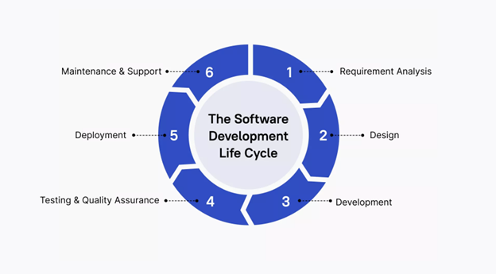

# Developer use-cases for AI with GitHub Copilot

## Boost developer productivity with AI

GitHub Copilot offers numerous ways to accelerate and simplify common development tasks. Let's examine some key areas where GitHub Copilot proves particularly beneficial.

### Accelerate learning new programming languages and frameworks

Learning new programming languages or frameworks can be challenging, but GitHub Copilot makes this process smoother and faster, enabling developers to quickly grasp new concepts and apply them in practice. GitHub Copilot helps bridge the gap between learning and actual implementation through:

* **Code suggestions**: Offers context-aware code snippets suggestions that illustrate the usage of unfamiliar functions and libraries, guiding developers on proper usage and implementation when working with new frameworks.
* **Language support**: Supports a wide range of languages, helping you transition smoothly from one language to another.
* **Documentation integration**: By providing inline suggestions related to API usage and function parameters, GitHub Copilot reduces the need to constantly refer to external documentation.

### Minimizing context switching

Context switching is a significant productivity drain for developers and can disrupt your workflow and reduce focus. GitHub Copilot helps maintain focus by providing relevant code suggestions within your current context, allowing you to concentrate on solving complex problems. The following are ways GitHub Copilot help to achieve this:

* **In-editor assistance**: GitHub Copilot provides code suggestions directly in the IDE, minimizing the need to search for solutions online.
* **Quick references**: When working with APIs or libraries, GitHub Copilot can suggest correct method calls and parameters, reducing the need to consult documentation.
* **Code completion**: By autocompleting repetitive code patterns, GitHub Copilot allows developers to maintain their train of thought without interruption.

### Enhanced documentation writing

GitHub Copilot significantly improves the process of writing and maintaining code documentation:

* **Inline comments**: Generates contextually relevant inline comments explaining complex code sections.
* **Function descriptions**: Automatically suggests function descriptions, including parameter explanations and return value details.
* **README generation**: Assists in creating project README files by suggesting structure and content based on the project's codebase.
* **Documentation consistency**: Helps maintain consistent documentation style across a project.

### Automating the boring stuff

GitHub Copilot excels at handling routine coding tasks, freeing up time for developers to focus on more complex and creative aspects of their work. Here are ways to leverage GitHub Copilot for automation:

* **Boilerplate code generation**: GitHub Copilot can quickly produce boilerplate code for common functionalities, such as setting up a REST API or creating a class structure.
* **Sample data creation**: When testing, GitHub Copilot can generate realistic sample data, saving time on manual data creation.
* **Writing unit tests**: GitHub Copilot can suggest test cases and even generate entire unit tests based on the code suggested.
* **Code translation and refactoring**: GitHub Copilot assists in code refactoring by suggesting improved patterns or more efficient implementations and even converting programming languages.

### Advanced boilerplate automation scenarios

GitHub Copilot can handle more sophisticated automation tasks that would typically require significant manual effort:

* **Database schema and ORM setup**: Generate complete database models, migration files, and ORM configurations based on simple entity descriptions.
* **API endpoint scaffolding**: Create entire REST API endpoints with proper error handling, validation, and documentation comments.
* **Configuration management**: Generate configuration files for different environments (development, staging, production) with appropriate settings.
* **Test infrastructure**: Set up complete testing frameworks including mock data, fixtures, and helper functions for complex testing scenarios.

### Story-driven development automation

GitHub Copilot excels at transforming simple user stories and feature requirements directly into complete, production-ready implementations:

* **Feature scaffolding**: Convert high-level feature descriptions into complete code structures with proper separation of concerns, including database models, API endpoints, and frontend components.
* **Business logic implementation**: Generate core functionality based on business rules described in plain language, automatically handling common patterns like validation, data transformation, and workflow logic.
* **Integration patterns**: Create standardized patterns for connecting different parts of your application ecosystem, including authentication, logging, and external service integration.
* **End-to-end automation**: From a single user story, generate the complete feature stack including backend logic, database changes, API documentation, and basic frontend implementation.
* **Quality built-in**: Automatically include error handling, input validation, logging, and basic security considerations as part of the initial implementation.

This approach enables rapid iteration from concept to working prototype, allowing teams to validate ideas quickly and gather feedback early in the development process.

### Accelerating pull request workflows

GitHub Copilot transforms the pull request process by generating changes that are review-ready and reducing the time from development to deployment:

#### PR-ready code generation

When working on features or bug fixes, Copilot helps create comprehensive changes that minimize review cycles:

* **Complete implementations**: Generate full feature implementations with proper error handling, logging, and edge case coverage.
* **Consistent code patterns**: Ensure new code follows established project conventions and architectural patterns.
* **Documentation integration**: Include inline comments, function documentation, and README updates as part of the initial code generation.
* **Test coverage**: Generate corresponding unit tests, integration tests, and example usage alongside new functionality.

#### Intelligent code review assistance

Copilot can help prepare code for review and even assist during the review process itself:

* **Pre-submission quality checks**: Before creating a PR, use Copilot to identify potential issues, suggest improvements, and ensure code quality standards are met.
* **Review comment drafting**: Generate constructive, specific review comments that explain issues clearly and suggest concrete improvements with code examples.
* **Rapid iteration**: When reviewers request changes, Copilot can immediately generate multiple implementation alternatives, allowing authors to choose the best approach without extensive rewriting.
* **Documentation refinement**: Automatically improve code comments and documentation based on reviewer questions and feedback, ensuring clarity for future maintainers.
* **Conflict resolution**: Assist in resolving merge conflicts by understanding the intent of both code branches and suggesting optimal integration approaches.

This streamlined approach significantly reduces the number of review rounds required, enabling faster feature delivery while maintaining high code quality standards.

### Collaborative development workflows

Copilot enhances team collaboration by ensuring consistency and quality across different developers' contributions:

* **Code standardization**: Help maintain consistent coding styles and patterns across team members.
* **Knowledge sharing**: Generate code that follows team best practices, helping junior developers learn from senior patterns.
* **Context preservation**: When taking over someone else's work, Copilot can help understand existing code and continue development in the same style.
* **Merge conflict resolution**: Assist in resolving complex merge conflicts by understanding the intent of both code branches.

### Orchestrated AI workflows

Modern development increasingly benefits from coordinated AI assistance across different aspects of the development process. GitHub Copilot can work as part of orchestrated workflows where multiple AI capabilities complement each other:

#### Multi-agent development patterns

Consider a workflow where different AI agents handle distinct aspects of feature development:

* **Draft agent**: Copilot generates initial code implementations based on feature requirements
* **Review agent**: A secondary AI reviews the draft for code quality, security issues, and adherence to project standards
* **Documentation agent**: Automatically generates or updates documentation based on the code changes
* **Test agent**: Creates comprehensive test suites for the new functionality

This orchestrated approach ensures comprehensive coverage of development tasks while maintaining high quality standards. Each agent brings specialized focus to its domain, resulting in more thorough and production-ready code.

### Advanced reasoning capabilities

For complex development scenarios, GitHub Copilot offers premium reasoning modes that provide deeper analysis and more sophisticated code generation:

* **Enhanced context understanding**: Analyzes larger codebases and more complex relationships between components
* **Advanced architectural suggestions**: Provides recommendations for system design and integration patterns
* **Complex refactoring assistance**: Handles sophisticated code transformations while preserving functionality
* **Multi-file coordination**: Orchestrates changes across multiple files while maintaining consistency

### Automated story completion workflows

GitHub Copilot can transform user stories and requirements into complete, deployable features through automated workflows:

* **Requirements parsing**: Analyze user stories and acceptance criteria to generate implementation plans
* **Feature scaffolding**: Create complete feature structures including controllers, services, models, and tests
* **Integration setup**: Generate the necessary code to integrate new features with existing system components
* **Quality assurance automation**: Include comprehensive error handling, logging, and monitoring for new features

This approach enables rapid progression from concept to working software, significantly reducing the time between idea and implementation.

### Personalized code completion

GitHub Copilot adapts to individual coding styles and project contexts, providing increasingly relevant suggestions over time and improving code efficiency. Here is how GitHub Copilot achieves personalized code completion:

* **Contextual understanding**: GitHub Copilot analyzes the development environment and project structure to offer more accurate and relevant code completions.
* **Learning from patterns**: As developers work on a project, GitHub Copilot learns from their coding patterns and preferences, tailoring suggestions accordingly.

## Align with developer preferences

GitHub Copilot is designed to seamlessly integrate into developers' workflows, adapting to their preferences and coding styles. This unit explores how GitHub Copilot caters to common developer needs and enhances various aspects of the coding process.

### Developer tastes and AI assistance

Developers have diverse preferences when it comes to their coding environment and workflow. GitHub Copilot is flexible enough to accommodate these preferences while providing valuable AI-powered assistance.

### Code generation and completion

GitHub Copilot excels at generating and completing code, aligning with developers' desire for efficiency and accuracy.

* Multiple suggestions: When faced with ambiguous scenarios, GitHub Copilot provides multiple code suggestions, allowing developers to choose the most appropriate option.
* Language-specific idioms: GitHub Copilot understands and suggests language-specific idioms and best practices, helping developers write more idiomatic code.

### Writing unit tests and documentation

Many developers find writing tests and documentation to be less engaging than writing core functionality. GitHub Copilot assists in these crucial but often tedious tasks.

* Test case generation: Based on function signatures and behavior, GitHub Copilot can suggest relevant test cases, including edge cases that developers might overlook.
* Documentation stubs: GitHub Copilot can generate initial documentation stubs for functions, classes, and modules, which developers can then refine.
* Comment expansion: When developers write brief comments, GitHub Copilot can expand them into more detailed explanations, saving time on documentation.

### Code refactoring

Refactoring is an essential part of maintaining healthy codebases. GitHub Copilot aids in this process by suggesting improvements and alternative implementations.

* Pattern recognition: GitHub Copilot identifies common patterns in code and suggests more efficient or cleaner alternatives.
* Modern syntax suggestions: For languages with evolving syntax (like JavaScript ECMAScript), GitHub Copilot can suggest modern language features that may be more concise or performant.
* Consistency maintenance: GitHub Copilot helps maintain consistency across the codebase by suggesting refactoring that aligns with existing code style.

### Debugging assistance

While GitHub Copilot isn't a full-on debugger, it can assist in the debugging process in several ways:

* Error explanation: When faced with error messages, GitHub Copilot can often provide plain-language explanations and suggest potential fixes.
* Log statement generation: GitHub Copilot can suggest relevant log statements to help diagnose issues in complex code paths.
* Test case suggestions: For bugs that are difficult to reproduce, GitHub Copilot can suggest additional test cases that might help isolate the issue.

### Data science support

Beyond conventional code generation, GitHub Copilot offers valuable assistance for more advanced tech like data science and analysis, streamlining various aspects of the data science workflow:

* Statistical functions: It provides assistance in implementing statistical functions and tests, helping data scientists quickly apply appropriate statistical methods by adapting to the datasets.
* Data visualization: It offers code suggestions for creating data visualizations using popular libraries like Matplotlib, Seaborn, or Plotly, helping data scientists quickly generate insightful graphs and charts.
* Data preprocessing: It can suggest code for common data preprocessing tasks such as handling missing values, encoding categorical variables, or scaling numerical features.
* Model evaluation: GitHub Copilot can assist in writing code for model evaluation metrics and visualization of model performance.

### Preference for streamlined workflows

Modern developers increasingly value workflows that minimize context switching and reduce manual overhead. GitHub Copilot aligns with these preferences through several key capabilities:

Integrated development experience

Developers prefer tools that work seamlessly within their existing environment rather than requiring external applications or complex setup:

* IDE-native assistance: GitHub Copilot operates directly within popular development environments, providing suggestions without breaking focus.
* Contextual awareness: The tool understands the current project context, suggesting relevant code that fits naturally with existing patterns and conventions.
* Minimal configuration: Unlike many AI tools that require extensive setup, GitHub Copilot works effectively with minimal configuration, respecting developer preference for "it just works" tools.

### Autonomous task completion

Many developers appreciate tools that can handle entire features or stories independently, reducing the need for manual intervention:

* End-to-end feature generation: From user requirements to deployable code, including tests and documentation, all generated in a cohesive manner.
* Smart defaults: GitHub Copilot chooses sensible defaults for implementation details, allowing developers to focus on high-level logic rather than boilerplate decisions.
* Progressive enhancement: Developers can start with generated code and then refine it, rather than starting from scratch, which aligns with preferences for iterative development.

### Quality-first automation

Developers want automation that enhances rather than compromises code quality:

* Built-in best practices: Generated code incorporates security considerations, error handling, and performance optimizations from the start.
* Consistency maintenance: Automated code follows project conventions and team standards without requiring manual enforcement.
* Comprehensive coverage: Features come with appropriate testing and documentation, meeting professional development standards automatically.

## AI in the Software Development Lifecycle (SDLC)

Image by Akinrefon Shedrack Tobiloba, from ['Understanding the Software Development Life Cycle (SDLC)'](https://codewithshedrack.substack.com/p/understanding-the-software-development/)

### Requirement analysis

While GitHub Copilot does not directly gather requirements, it can assist in translating requirements into initial code structures:

* Rapid prototyping: Quickly generate code snippets based on high-level descriptions, allowing for faster proof-of-concept development.
* User story implementation: Transform user stories into initial function or class definitions, providing a starting point for development.
* API design: Suggest API structures based on described functionality, helping to flesh out system architectures.

### Design & development

This is where GitHub Copilot truly shines, offering significant productivity boosts:

* Boilerplate code generation: Automatically create repetitive code structures, saving time on setup tasks.
* Design pattern implementation: Suggest appropriate design patterns based on the problem context, promoting best practices.
* Code optimization: Offer more efficient code alternatives, helping developers write performant code from the start.
* Cross-language translation: Assist in translating concepts or code snippets between different programming languages.

### Testing & quality assurance

GitHub Copilot can significantly streamline the testing process:

* Unit test creation: Generate test cases based on function signatures and behavior, ensuring comprehensive test coverage.
* Test data generation: Create realistic test data sets, saving time on manual data creation.
* Edge case identification: Suggest test scenarios that cover edge cases, improving the robustness of tests.
* Assertion suggestions: Propose appropriate assertions based on the expected behavior of the code being tested.

### Automated testing workflows

GitHub Copilot can orchestrate comprehensive testing strategies that go beyond individual test creation:

* Test suite architecture: Design complete testing frameworks that include unit tests, integration tests, and end-to-end testing scenarios for complex features.
* Test automation pipelines: Generate test configuration files and CI/CD integration that automatically runs appropriate test suites based on code changes.
* Quality gates: Create automated quality checks that ensure code meets standards before progression through the development pipeline.
* Performance testing: Generate performance benchmarks and load testing scenarios to validate system behavior under various conditions.

This automated approach ensures that quality assurance becomes an integrated part of the development process rather than a separate phase, enabling faster delivery with maintained quality standards.

### Deployment

While not directly involved in deployment processes, GitHub Copilot can assist in related tasks:

* Configuration file generation: Help create deployment configuration files for various environments.
* Deployment script assistance: Suggest commands or scripts for common deployment tasks.
* Documentation updates: Assist in updating deployment documentation to reflect recent changes.

### Maintenance & support

GitHub Copilot proves valuable in ongoing maintenance tasks:

* Bug fix suggestions: Propose potential fixes for reported issues based on error messages and surrounding code.
* Code refactoring: Suggest improvements to existing code, helping to keep the codebase modern and efficient.
* Documentation updates: Assist in keeping code comments and documentation in sync with changes.
* Legacy code understanding: Help developers understand and work with unfamiliar or legacy code by providing explanations and modern equivalents.

### Building with orchestrated AI workflows

Modern software development increasingly benefits from coordinated AI assistance where multiple AI capabilities work together to handle complex development tasks. This orchestrated approach combines the strengths of different AI agents to deliver comprehensive solutions.

###  Simple agent orchestration patterns

Consider a basic two-agent workflow for feature development:

1. Draft agent (GitHub Copilot): Analyzes feature requirements and generates initial implementation including:

    * Core functionality with proper error handling
    * Basic unit tests covering main scenarios
    * Inline documentation explaining the implementation
    * Integration points with existing code

2. Review agent: Analyzes the draft code and provides:

    * Code quality assessment against project standards
    * Security vulnerability identification
    * Performance optimization suggestions
    * Architectural pattern compliance review

This coordinated approach ensures that code meets quality standards before human review, significantly reducing the number of review iterations needed.

### Advanced orchestration capabilities

For complex development scenarios, multi-agent workflows can handle sophisticated requirements:

### Premium reasoning integration

Advanced AI reasoning provides deeper analysis for complex development challenges:

* Architectural decision support: Analyze trade-offs between different implementation approaches considering scalability, maintainability, and performance.
* Cross-system impact analysis: Understand how changes in one component affect other parts of a distributed system.
* Complex refactoring coordination: Orchestrate changes across multiple files and modules while preserving system functionality and performance.
* Integration pattern optimization: Suggest optimal patterns for connecting new features with existing system architecture.

### Comprehensive feature delivery workflows

Orchestrated AI can handle complete feature delivery from requirements to deployment:

1. Analysis phase: Parse user stories and technical requirements to create implementation plans
2. Implementation phase: Generate complete feature code including all necessary components
3. Quality assurance phase: Create comprehensive test suites and quality checks
4. Documentation phase: Generate user documentation, API docs, and maintenance guides
5. Deployment phase: Create deployment scripts and monitoring configurations

This end-to-end automation enables teams to deliver features faster while maintaining high quality standards across all aspects of development.

## Understand limitations and measure impact

### Code quality and correctness

* Potential for errors: GitHub Copilot can sometimes suggest code that contains bugs or doesn't fully meet requirements.
* Security concerns: Generated code may not always adhere to best security practices, requiring careful review.
* Context misinterpretation: GitHub Copilot might misunderstand the broader context, leading to inappropriate suggestions.

### Language and framework specificity

* Varying performance: GitHub Copilot's effectiveness can vary across different programming languages and frameworks.
* Niche technologies: For less common or newer technologies, suggestions may be less accurate or relevant.

### Dependency on training data

* Bias in suggestions: GitHub Copilot's suggestions reflect patterns in its training data, which may include biases or outdated practices.
* Copyright concerns: There's ongoing debate about the copyright implications of code generated from trained models.

### Complex problem solving

* Limitation in high-level design: GitHub Copilot excels at code-level tasks but may not grasp complex architectural decisions.
* Creativity constraints: While helpful, GitHub Copilot cannot replace human creativity in solving novel problems.

### Measure productivity gains

Understanding the productivity gains provided by GitHub Copilot is essential to maximizing its benefits. The REST API for GitHub Copilot usage metrics and GitHub Copilot Developer Survey offers a powerful way to measure and analyze how GitHub Copilot influences your development workflow. This section introduces methods to evaluate GitHub Copilot’s impact using these tools and related metrics.

### Use the REST API endpoints for GitHub Copilot usage metrics

GitHub provides a REST API to access GitHub Copilot usage metrics for enterprise members, teams, and organization members. These metrics offer insights into daily usage of GitHub Copilot, including completions, chat interactions, and user engagement across different editors and languages.

### Get a summary of GitHub Copilot usage for enterprise members

Endpoint: `GET /enterprises/{enterprise}/GitHub Copilot/usage`

This endpoint provides a daily breakdown of aggregated usage metrics for GitHub Copilot completions and GitHub Copilot Chat across all users in an enterprise. It includes details on suggestions, acceptances, and active users, further broken down by editor and language.

### Get a summary of GitHub Copilot usage for an enterprise team

Endpoint: `GET /enterprises/{enterprise}/team/{team_slug}/GitHub Copilot/usage`

This endpoint provides a daily breakdown of aggregated usage metrics for GitHub Copilot completions and GitHub Copilot Chat within a specific enterprise team.

### Get a summary of GitHub Copilot usage for organization members

Endpoint: `GET /orgs/{org}/GitHub Copilot/usage`

This endpoint provides a daily breakdown of aggregated usage metrics for GitHub Copilot completions and GitHub Copilot Chat across an organization.

### Implementing a measurement framework

To systematically assess GitHub Copilot’s impact, consider the following framework, using the GitHub Copilot usage metric API at each stage:

1. **Evaluation**: During the initial phase of adopting GitHub Copilot, focus on leading indicators such as developer satisfaction and task completion rates. Use the API to collect metrics like Average Daily Active Users, Total Acceptance Rate, and Lines of Code Accepted.
2. **Adoption**: As GitHub Copilot becomes more integrated into your team’s workflow, continue to monitor productivity metrics and enablement indicators. The API can provide insights into user engagement and identify areas where further training may be needed.
3. **Optimization**: Once GitHub Copilot is fully adopted, use the REST API for GitHub Copilot usage metrics to fine-tune its impact on broader organizational goals, such as reducing time-to-market or improving code quality across the team.
4. **Sustained efficiency**: Continuously evaluate GitHub Copilot’s effectiveness as your organization evolves. The API allows for ongoing monitoring and adjustment to ensure long-term productivity gains.

### Use the GitHub Copilot developer survey

The GitHub Copilot Developer Survey is a valuable tool designed to gather insights from your teams, helping you understand how GitHub Copilot is being used, its benefits, and any challenges developers face. This survey is divided into two formats: short-form and long-form, each serving different purposes throughout the GitHub Copilot evaluation and adoption stages.

1. Survey cadence and timing

When deploying the GitHub Copilot Developer Survey, it's important to establish a regular cadence to avoid survey fatigue while still gathering meaningful data.

* Short-form survey: Can be conducted every two weeks if frequent feedback is needed, especially when coupled with other feedback channels like online or in-person discussions.
* Long-form survey: Recommended to be conducted no more than once every four weeks, particularly at the end of the evaluation and adoption stages, to capture comprehensive feedback.

2. Structuring the survey

The survey questions should be tailored to fit your organization’s specific needs, ensuring that the data collected is relevant and actionable. Here’s how to structure both the short-form and long-form surveys:

* Short-form survey: Focuses on immediate feedback, capturing developers' overall satisfaction with GitHub Copilot, specific challenges faced, and time saved or wasted.

    Example questions:

    * "How would you feel if you could no longer use GitHub Copilot?"
    * "When using GitHub Copilot, I enjoy coding more / write better quality code / complete tasks faster."
    * "What challenges have you encountered in using GitHub Copilot since your last survey?"

    * Long-form survey: Offers a deeper analysis of GitHub Copilot’s impact, capturing detailed insights into its usage and benefits, and how it affects team dynamics.

    Example questions:

    * "I use GitHub Copilot to code in a familiar language / explore a new language / write repetitive code."
    * "When using GitHub Copilot, my team provides better code reviews / merges code to production faster."
    * "What challenges have you encountered in using GitHub Copilot since your last survey?"

3. Analyzing survey results

Once the surveys are completed, it’s important to analyze the results systematically:

* Privacy considerations: Ensure that survey responses are anonymized and cannot be traced back to individual developers, meeting privacy obligations.
* Data tracking: Collate the survey responses into existing Business Intelligence (BI) tools or spreadsheets for ease of analysis. Over time, track the results to identify trends and make informed decisions about GitHub Copilot’s implementation.

4. Continuous improvement

Use the insights gathered from the surveys to make informed decisions about GitHub Copilot's deployment in your organization. Focus on addressing the challenges identified, leveraging the benefits reported by developers, and adjusting the tool’s use to maximize productivity.

The GitHub Copilot Developer Survey is a critical component in understanding and enhancing the use of GitHub Copilot within your teams.

By leveraging the REST API and survey for GitHub Copilot usage metrics, you can move beyond anecdotal evidence and gain concrete insights into how GitHub Copilot influences your coding process. This data-driven approach allows for informed decision-making and continuous improvement on GitHub Copilot's role in the development workflow and helps identify areas where its use can be optimized for maximum benefit.
