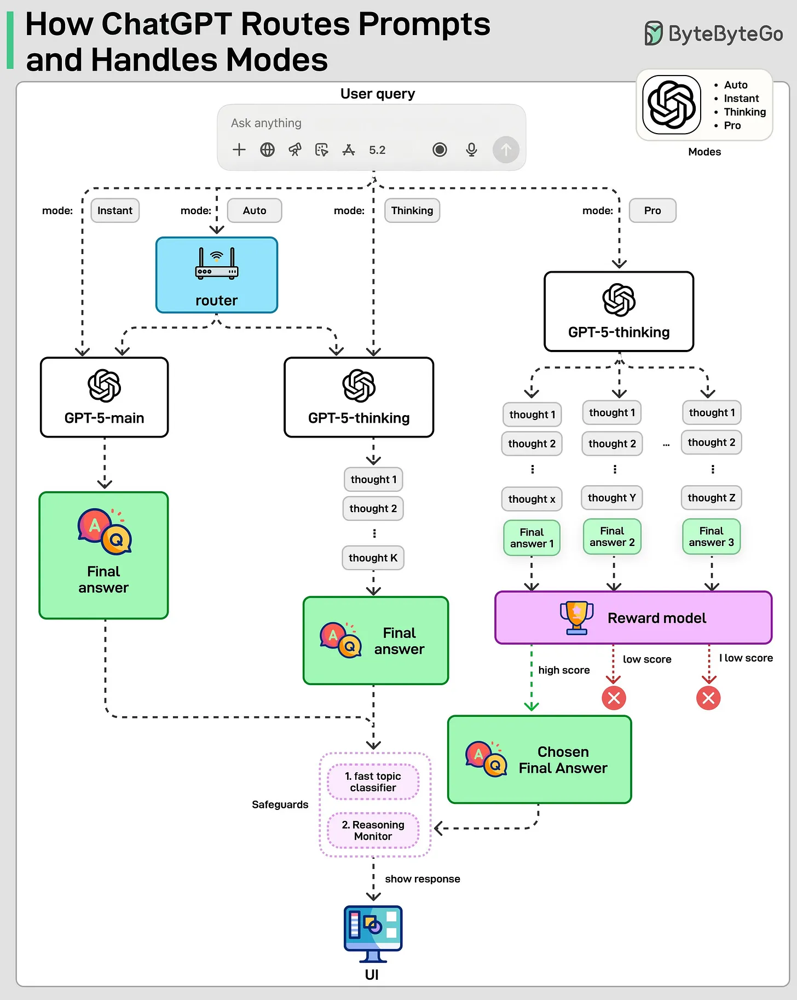

# MCP vs RAG vs AI Agents

They solve very different problems at different layers of the stack.

## Definitions

**MCP**

MCP (Model Context Protocol) is about how LLMs use tools. Think of it as a standard interface between an LLM and external systems. Databases, file systems, GitHub, Slack, internal APIs.

Instead of every app inventing its own glue code, MCP defines a consistent way for models to discover tools, invoke them, and get structured results back. MCP doesn’t decide what to do. It standardizes how tools are exposed.

**RAG**

RAG (Retrieval-Augmented Generation) is about what the model knows at runtime. The model stays frozen. No retraining. When a user asks a question, a retriever fetches relevant documents (PDFs, code, vector DBs), and those are injected into the prompt.

RAG is great for:

* Internal knowledge bases
* Fresh or private data
* Reducing hallucinations

But RAG doesn’t take actions. It only improves answers.

**AI Agents**

AI Agents are about doing things. An agent observes, reasons, decides, acts, and repeats. It can call tools, write code, browse the internet, store memory, delegate tasks, and operate with different levels of autonomy.

## ChatGPT Routing Prompts & Handling Modes

GPT-5 is not one model.

It is a unified system with multiple models, safeguards, and a real-time router. This post and diagram are based on our understanding of the GPT 5 system card. When you send a query, the mode determines which model to use and how much work the system does.

Instant mode sends the query directly to a fast, non-reasoning model named GPT-5-main. It optimizes for latency and is used for simple or low-risk tasks like short explanations or rewrites.

Thinking mode uses a reasoning model named GPT-5-thinking that runs multiple internal steps before producing the final answer. This improves correctness on complex tasks like math or planning.

Auto mode adds a real-time router. A lightweight classifier looks at the query and decides whether to use GPT-5-main or GPT-5-thinking when deeper reasoning is needed.

Pro mode does not use a different model. It uses GPT-5-thinking but samples multiple reasoning attempts and selects the best one using a reward model.

Across all modes, safeguards run in parallel at various stages. A fast topic classifier determines whether the topic is high-risk, followed by a reasoning monitor that applies stricter checks to ensure unsafe responses are blocked.

## Agent Skills

Long prompts hurt agent performance. Instead of one massive prompt, agents keep a small catalog of skills, reusable playbooks with clear instructions, loaded only when needed.

Here is what the Agent Skills workflow looks like:

1. User Query: A user submits a request like “Analyze data & draft report”.
2. Build Prompt + Skills Index: The agent runtime combines the query with Skills metadata, a lightweight list of available skills and their short descriptions.
3. Reason & Select Skill: The LLM processes the prompt, thinks, and decides: "I want Skill X."
4. Load Skill into Context: The agent runtime receives the specific skill request from the LLM. Then, it loads SKILL. md and adds it into the LLM's active context.
5. Final Output: The LLM follows SKILL. md, runs scripts, and generates the final report.

By dynamically loading skills only when needed, Agent Skills keep context small and the LLM’s behavior consistent.

## AI
