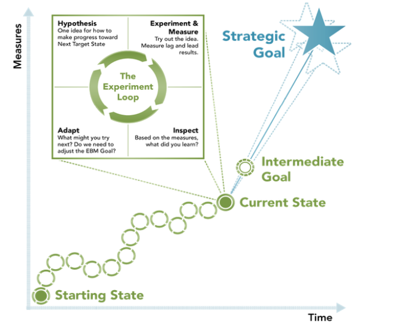
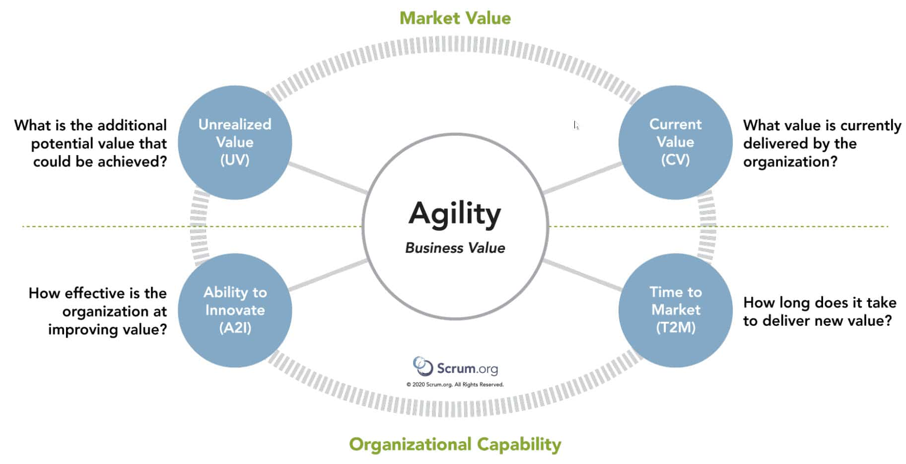

# Evidence-based Management (EBM)

## Definition

Evidence-based management (EBM) is an empirical approach that helps organizations make better decisions by using current evidence. It involves setting aside conventions and opinions in favor of critical thinking and the best available evidence. EBM can help organizations improve customer outcomes, business results, and organizational capabilities, even in <u>uncertain situations</u>.

## Goals and Measures

1. Strategic Goals

    * Something important that the Organization would like to achieve.
    * Something large and far away; there are many uncertainties.

2. Intermediate Goals

    * Achievements that indicate the Organization is on the path toward the Strategic Goal.
    * Somewhat uncertain, but not completely unknown.

3. Immediate Tactical Goals

    * Critical near-term objectives toward which a team or group of teams work to achieve Intermediate Goals.

## Value

### Input

Things that the organization spends money on. While necessary to produce value, there is no correlation between the amount of input and the value that the customer experiences.

### Activities

These are things that people in the organization do: perform work, go to meetings, have discussions, write code, create reports, attend conferences, ...

### Outputs

These are things that the organization produces: product releases (including features), reports, defect reports, product reviews, ...

### OUTCOMES

Desireable things that a customer or user of a product experiences. They represent some new or improved capability that the customer or user was not able to achieve before.

### Impacts

Results that the organization or its non-customer stakeholders (such as investors) achieve when customers or users of a product achieve their desired outcomes: increased revenue or profit, improved market share, ...

## Key Value Areas (KVAs)

> Market Value versus Organizational Capability

Delivering businee value **(Current Value)** is important, but organizations must also show that they can respond to change **(Time to Market)** while being able to sustain innovation over time **(Ability to Innovate)**. And they must be able to continually make progress toward their long-term goals **(Unrealized Value)** or they risk succumbing to stagnation and complacency.

### Unrealized Value

This is the potential future value that could be realized if the organization met the needs of all potential customers or users.

### Current Value

This is the value that an organization delivers to customer and stakeholders at the present time.

* How happy are the users and customer today? Is their happiness improving or declining?
* How happy are the employees today? Is their happiness improving or declining?
* How happy are the investors and stakeholders today? Is their happiness improving or declining?

### Ability to Innovate

The effectiveness of an organization to deliver new capabilities that might better meet customer needs.

* What prevents the organization from delivering new value?
* What prevents customers or users from benefitting from that innovation?

### Time to Market

The organization's ability to quickly deliver new capabilites, services, or products.

* How fast can the organization learn from new experiments and information?
* How fast can you adapt based on that information?
* How fast can you test new ideas with customers?

## Key Value Measures

What should be measured? "It depends."

## Where to Start

1. Look at goals.

    * Are they outcome focused?
    * Use the 9 "whys" experiment to figure out the outcome.
    * What is the strategic goal? Intermediate goal? Using Sprint goals?

2. Start measuring

    * Make this transparent.
    * Time to Market.
    * Ability to Innovate.

3. Start Slow

## Applying EBM

