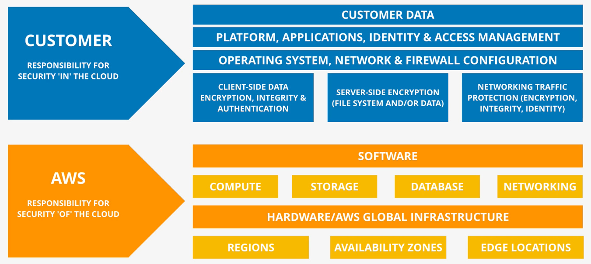

# AWS Fundamentals

## AWS Public versus Private Services

Networking Perspective ...

1. "Public Internet" Zone
2. "AWS Public" Zone
3. "AWS Private" Zone

AWS Private Zone ...

* VPCs are isolated unless configured otherwise.
* On-premises can only access VPCs if configured via VPN or Direct Connect.
* Private services (example, EC2) can be given a **public IP - 1:1** that is translated by the IGW.

AWS Public Zone ...

* Connected to the Public Internet Zone.

## AWS Global Infrastructure

* AWS Regions (not mapped to countries).
* AWS Edge Locations (local distribution points).

Regions ...

* Geographic Separation - Isolated Fault Domain.
* Geopolitical Separation - Different governance.
* Location Control - Performance.

Availability Zones (AZs) ...

* Isolated infrastructure within a region.

Service Resilience ...

* Globally Resilient (examples, IAM and Route 53).
* Region Resilient.
* AZ Resilient.

## AWS Default Virtual Private Cloud (VPC)

A VPC is a Virtual Network inside AWS.

* A VPC is within one account and one region.
* By default, it is Private and Isolated unless it's configured otherwise.
* Two types - Default VPC (one per Region) and Custom VPCs.

Default VPC Notes ...

* **One Default VPC per Region**, it can be removed and recreated.
* Default VPC CIDR is always `127.31.0.0/16`.
* `/20` Subnet in each AZ in the Region.
* Comes with and Internet Gateway (IGW), Security Group (SG), and NACL preconfigured.
* Subnets assign public IPv4 addresses.

## Elastic Compute Cloud (EC2)

IaaS = Infrastructure as a Service.

* EC2 Provides Virtual Machines, Instances.
* **Private** service by-default, uses VPC networking.
* AZ Resilient, Instance fails if an AZ fails.
* Different instance sizes and capabilities.
* On-Demand Billing, per second or per hour.
* Local on-host storage or Elastic Block Store (EBS).

Instance Lifecycle ...

Involves CPU, Memory, Disk, and Networking.

1. Running - charges for all four.
2. Stopped - charge only for storage.
3. Terminated - no charges.

### Amazon Machine Image (AMI)

* Can be used to create a Machine Image.
* Can be created from a Machine Image.

Contains ...

* Root Volume
* Block Device Mapping
* Permissions

Permissions ...

  1. Public - Everyone allowed.
  2. Owner - Implicit allow.
  3. Explicit - Specific AWS Accounts allowed.

## DEMO: Creating an EC2 Instance

1. Login and navigate to the EC2 Dashboard.
2. Select **Key Pairs**, Create Key Pair.
3. Select PEM if not using Putty.
4. Save the `.CER` file
5. Select EC2 Dashboard, then Launch, and Launch Instance.
6. Select "Amazon Linux 2 AMI (HVM)," the first one **Free Tier Eligible**.
7. Select **t2.micro** Type, **Free Tier Eligible**, then Next (Configure Instance Details). Network, Subnet, and Auto-Assign Public IP can be selected here.
8. Select Next (Add Storage).
9. Select Next (Add Tags).
10. Select Next (Configure Security Groups), set to "My IP Address."
12. Review and Launch, then Launch.
13. Select an existing key pair or create a new key pair. Select the key pair created above.
14. Launch Instance, then View Instances.

Connecting ...

1. Right-click on the instance and select Connect.
2. Select the SSH Tab.
3. Copy the example `SSH` Command (may need to run the `chmod` command to fix permissions).

Exercise ...

1. Click Instances at the top.
2. Select the running Instance, then on the Instance State dropdown choose **Stop Instance**.
2. Select the stopped Instance, then on the Instance State dropdown choose **Start Instance**.

## Simple Storage Service (S3) Basics

* **Global Storage Platform** that is regional-based and regional-resilient.
* **Public service**, unlimited data and multi-user.
* Can handle massive amounts of data (movies, audio, photos, text, large data sets, etc.).
* Economical and accessed via UI, CLI, API, HTTP.
* Delivers Objects and Buckets.

Objects ...

* Key: e.g. `koala.jpg`.
* Value: Content being stored (0-bytes to 5 TB).
* Version ID.
* Metadata.
* Access Control.
* Subresources.

Buckets ...

**Blast Radius** in case of failure or corruption = Region.

* In a specific AWS Region.
* Data inside a bucket has a primary home region; it never leaves the region unless it is configured to leave.
* **Bucket name is Globally Unique**.
* Can hold unlimited Objects.
* Flat Structure, all Objects stored at the same level (root).
* `/old/koala.jpg` is the complete Key; the UI displays the `old` as a file, even though it is actually a part of the Key (or name).

### Summary

* Bucket Limits: 100 is a soft limit, 1,000 hard limit per Account.
* Unlimited Objects in a Bucket, **0-bytes to 5 TB**.
* Key/Value Structure = Name/Data.

**Bucket names** ...

* **Are Globally Unique**.
* 2-63 characters, all lowercase, and no underscores.
* Start with a lowercase letter or a number.
* Cannot be IP formatted (example, 1.1.1.1).

### Patterns and Anti-Patterns

* S3 is an Object store. It is not a file or block storage system.
* **Cannot mount** an S3 Bucket (`k:\` or `/images`).
* Great for large-scale data storage, distribution, or uploads.
* Great for *offloading* things.
* Input and/or Output to many AWS products.

## DEMO: Creating an S3 Bucket

1. Go to the S3 Console.
2. Click the **Create Bucket** button.
3. Select *Globally Unique Name* and *Region*.
4. Uncheck **Block *all* Public Access** and associated acknowledgment.
5. Click **Create Bucket** at the bottom of the page.

Once created ...

1. Click the Bucket Name to see what's inside it.

   * Properties Tab, Amazon Resource Name (ARN) - unique resource identifier.
   * Overview Tab, an overview of all the Objects in this bucket.

2. Click the **Upload** button.
3. Click the **Add Files** button, select files, and open.

   * The system will show the files and size estimates.
   * Destination will be unique to each bucket.
   * Versioning is not enabled at this point.
   * Storage class: Standard.

4. Click the **Upload** button.
5. Once they are all uploaded click the **Close** button to close the dialog.

Folders ...

Technically, there are no folders. This creates an object that allows the UI to display it as a folder. This process creates a file with a "name" that includes the `<foldername>`/`<filename>`.

1. Click the **Create Folder** button.
2. Provide a name for the folder.
3. Click the **Create Folder** button.
4. Click the named folder.
5. Click the **Upload** button.
6. Click the **Add Files** button, select a file, and open.
7. Click the **Upload** button.
8. Once they are all uploaded click the **Close** button to close the dialog.

Open an Object ...

1. Click the name of one of the files. This opens an overview with an **Object URL**.
2. Right-Click and Open in New Tab. This presents an `AccessDenied` Error (private by default).
3. Close the tab.
4. Click the **Open** button (authentication included in the URL).

Delete the Bucket ...

1. Return to the S3 Console.
2. Select the Bucket.
3. Click the **Empty** button.
4. Type in *permanently delete* into the input.
5. Click the **Empty** button.
6. Click the **Exit** button.
7. With the Bucket still selected, click the **Delete** button.
8. Enter the name of the bucket in the input.
9. Click the **Delete bucket** button.

## CloudFormation (CFN) Basics

CloudFormation is a tool that lets you create, update, and delete infrastructure at AWS in a consistent and repeatable way using templates.

[CloudFormation Resource Reference](https://docs.aws.amazon.com/AWSCloudFormation/latest/UserGuide/aws-template-resource-type-ref.html)

* YAML or JSON Templates

Templates ...

* `Resources`: (only MANDATORY PART) CloudFormation adds, updates, or deletes resources.
* `Description`: String, free text. Must immediately follow the `AWSTemplateFormatVersion`.
* `Metadata`: Controls how different things in the template are presented in the UI.
* `Parameters`: Fields to be entered when used.
* `Mappings`: Look-up Tables
* `Conditions`: Decision-making in the template. Create and use the condition.
* `Outputs`: When finished, presented output.

Basics ...

* When a template is used in any way, CloudFormation creates a Stack.
* The Stack contains all Logical Resources from the template.
* The Stack creates corresponding Physical Resources in the AWS Account.

## DEMO: Simple Automation with CFN

1. Go to the CloudFormation Console.
2. Click the **Create Stack** button.
3. Select "Template is ready" and "Upload a template file."
4. Click the **Choose file** button, select the template file, and click Open. This uploads this to an S3 Bucket created for this purpose.
5. Go to the EC2 Console in a new tab.
6. Select **Key Pair** and create click the **Create Key Pair** button.
7. Name it `A4L` for this demo, click the **Create Key Pair** button, and save the `.cer` file.
8. In the CloudFormation tab, click Next.
9. Name the stack, parameters are presented from the template.
10. Select the `myfirstec2instance` key and click the **Next** button.
11. Click the **Next** button again.
12. Scroll to the bottom and *acknowledge* that resources might be created.
13. Click on the **Create stack** button and the Stack creation process will begin.
14. WAIT for the process to complete.

Connecting (Session Manager) ...

1. Go to the EC2 tab.
2. Right-click on the Instance, select **Connect**.
3. Select the **Session Manager** tab.
4. A new tab is opened with a Session.
5. Enter `bash` for a more familiar interface.

Deleting ...

All logical resources then all physical resources deleted.

1. Go to the CloudFormation console.
2. Select the Stack.
3. Click the **Delete** button.
4. Click the **Delete** button on the modal.

## CloudWatch Basics

Collects and manages operational data.

* **Metrics** - AWS Products, applications, or on-premises. A metric is a time-ordered set of data points.
* CloudWatch **Logs** - AWS Products, applications, or on-premises.
* CloudWatch **Events** - AWS Services and Schedules.

Namespace ...

* Basically a container.
* `AWS/<service>` is reserved, example `AWS/EC2`.

Datapoints ...

* Each measurement is called a datapoint, timestamp and value.

Dimensions ...

* Dimensions separate datapoints for different things or perspectives within the same metric.

Alarms ...

* Created and linked to a particular metric.
* `OK`, `ALARM`, or `INSUFFICIENT_DATA`.
* `ALARM` triggers an action.

## DEMO: Simple Monitoring with CloudWatch

1. Go to the EC2 Console.
2. Select Launch Instance.
3. Click the **Select** button for the *Amazon Linux 2 AMI (HVM) - Kernel 5.10, SSD Volume Type*.
4. `t2.micro` (Free tier eligible) will be selected.
5. Click the **Next: Configure Instance Details** button.
6. Find and select **Enable ClousWatch Monitoring**.
7. Click the **Next: Add Storage** button.
8. Click the **Next: Add Tags** button.
9. Click the **Add Tag** button and enter a Tag (Key/Value Pair) to be used for Monitoring.
10. Click the **Next: Configure Security Group** button.
11. Click the **View and Launch** button.
12. Click the **Launch** button.
13. Choose "Proceed without a key pair," acknowledge, and click the **Launch Instances** button.
14. Click on the **Instance ID** to go to the Instances Console.

Monitoring Tab ...

1. Click the Instance row, then select the Monitoring tab at the bottom.

CloudWatch ...

1. Go to the CloudWatch Conole.
2. Select Alarms.
3. Click the **Create Alarm** button.
4. Click the **Select metric** button.
5. Click the **EC2** card.
6. Find the `CPUUtilization` Metric Name, select it, and click the **Select metric** button.
7. Change the Period to "1 minute."
8. In Conditions, set Static, Greater, and 15 (which is percent).
9. Click the **Next** button.
10. Click the **Remove** button to not have a notification.
11. Click the **Next** button.
12. Name the Alarm "CPUUsageOver15Percent."
13. Click the **Next** button.
14. Click the **Create alarm** button.

* It will be in the `Insufficient Data` initially.

Next Steps ...

1. Go to the EC2 Console.
2. Connect to the EC2 Instance.
3. Run `sudo amazon-linux-extras install epel -y` at the command line.
4. Run `sudo yum install stress -y` at the command line (stress utility).
5. Verify that the Alarm is in `OK` state, click to see the graph.
6. Run `stress -c 2` at the command line.
7. Check the Console to see the stress.
8. Press `CTRL-C` at the command line to stop the stress.
9. Verify that the Alarm returns to the `OK` state.

Clean up ...

1. Click on **All Alarms**, select the `CPUUsageOver15PercentAlarm`, then Actions > Delete.
2. Click on the **Delete** button.
3. Go to the EC2 Console, then Dashboard, and click on **Instances Running**.
4. Right-click on the EC2 Instance and select Terminate.
5. Click on the **Terminate** button.

## Shared Responsibility Model

This is how AWS provides clarity around which areas of system security are theirs, and which are owned by the customer.

|             | AWS          | Customer     |
|-------------|--------------|--------------|
| Responsible | Of the Cloud | In the Cloud |
| | Regions, AZ, Edge Locations | Client-side data (encryption, integrity, and authentication) |
| | Hardware, AWS Global Infrastructure | Server-side encryption (file system and/or data) |
| | Compute, Storage, Databases, Networking | Networking traffic protection (encryption, integrity, and identity) |
| | Software | Operating system, network, and firewall configuration |
| | | Platform, applications, identity, and access management |
| | | Customer Data |

## High Availability, Fault-Tolerance, and Disaster Recovery

* HA = High Availability
* FT = Fault Tolerance
* DR = Disaster Recovery

### High Availability (HA)

Aims to **ensure** an agreed level of operational **performance**, usually uptime, for a **higher than normal period**.

* Generally listed in a percent of uptime.
* Example: 99.9%, three 9s = 8.77 hours per year of downtime.
* Example: 99.999%, five 9s = 5.26 minutes per year of downtime.

### Fault-Tolerance (FT)

Is the property that enables a system to **continue operating properly** in the event of the **failure of some** (one or more faults within) of its **components**.

### Disaster Recovery (DR)

A set of policies, tools, and procedures to **enable the recovery** or **continuation** of **vital** technology infrastructure and systems **following a natural or human-induced disaster**.
