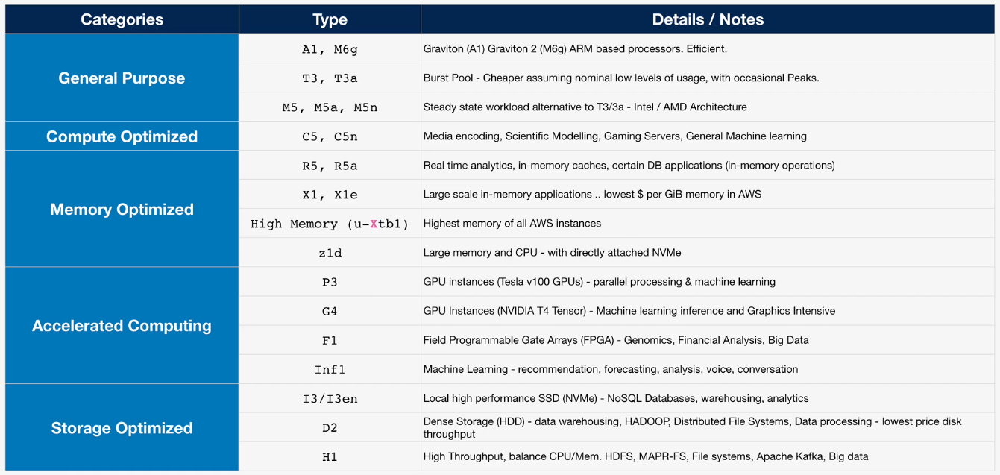

# Elastic Compute Cloud (EC2) Basics

## Virtualization 101

* A single piece of hardware running multiple applications.

Software Virtualization ...

* Host OS and Hypervisor (for Binary Translations).
* Guest OS and Application as a Virtual Machine.
* Emulated Virtualization.

Para-Virtualization ...

* Areas of the Guest OS that make Privileged Calls are modified to call the Hypervisor, removing the need for Binary Translation.
* Virtualization Aware.

Hardware-Assisted Virtualization ...

* Hypervisor / VMM, knows that Virtualization exists.

Single Route - IO Virtualization (SR-IOV) ...

* Allows add-on cards to present themselves as multiple cards to the Guest OS. No Hypervisor translation (hardware or software).
* In EC2, this feature is called **Enhanced Networking**.

## EC2 Architecture and Resilience

* EC2 Instances are **virtual machines** (OS and Resources).
* EC2 Instances run on **EC2 Hosts**.
* EC2 Instance Hosts are **Shared** Hosts or **Dedicated** Hosts.
* EC2 is an AZ-Resilient Service: The **Hosts** run inside a single AZ. If that AZ fails, the Host fails, and Instances Fail.

What is EC2 Good For? ...

* Traditional **OS and Application** Compute.
* **Long-Running** Compute.
* **Server**-style applications, either **burst** or **steady-state** load.
* **Monolithic** application loads.
* **Migrated** application workloads or **Disaster Recovery**.

## EC2 Instance Types

* **Raw** amount of resources. CPU, Memory, Local Storage Capacity, and Local Storage Type.
* **Resource Ratios**.
* **Storage** and **Data** Network **Bandwidth**.
* System Architecture and potentially the Vendor.
* Additional Features and Capabilities.

EC2 Categories ...

* **General Purpose - DEFAULT** - Diverse workloads, equal resource ratio.
* **Compute Optimized** = Media Processing, HPC, Scientific Modelling, Gaming, Machine Learning.
* **Memory Optimized** = Processing large in-memory datasets, some database workloads.
* **Accelerated Computing** - Hardware GPU, field-programmable gate arrays (FPGAs).
* **Storage Optimized** - Sequential and Random IO - scale-out transactional databases, data warehousing, ElasticSearch, analytics workloads.

Decoding EC2 Types ...

Instance Type (example): `R5db.8xlarge`

| Position                | Detail  |
|-------------------------|---------|
| Instance Family         | R       |
| Instance Generation     | 5       |
| Additional Capabilities | dn      |
| separator               | .       |
| Instance Size           | 8xlarge |

[EC2Instances.info, Easy Amazon EC2 Instnace Comparison](https://instances.vantage.sh/)

## DEMO: EC2 SSH versus EC2 Instance Connect

1. Go to the EC2 Console.
2. Select the **Key Pairs** link on the left.
3. Create the A4L Key Pair.
4. Connect via SSH.
5. Connect via Instance Connect.

## Storage Refresher

* **Direct** (local) attached Storage, storage on the EC2 Host.
* **Network** attached Storage, volumes delivered over the network (EBS).
* **Ephemeral** Storage, temporary Storage.
* **Persistent** Storage, permanent storage. It lives on past the lifetime of the instance.

Three main Categories of Storage on AWS ...

* **Block** Storage, volume presented to the OS as a collection of blocks. There is no structure provided. **Mountable and Bootable**.
* **File** Storage, presented as a file share. It has structure. **Mountable and NOT Bootable**.
* **Object** Storage, collection of objects (flat). **NOT Mountable and NOT Bootable**.

Storage Performance ...

IO Size x IOPS = Throughput

| IO (block) Size | IOPS                    | Throughput           |
|-----------------|-------------------------|----------------------|
| Wheels          | Engine Revolutions/s    | Speed of the Vehicle |
| 16K to 1MEG     | x Operations per Second | = xx Mbps            |
| 16KB | x 100 IOPS | = 1.6 Mbps |

## Elastic Block Store (EBS) Service Architecture

* **Block** Storage, raw disk allocations (volume). These volumes can be encrypted using KMS.
* Instances see a **block device** and create a **file system** on the device (ext3, ext4, or xfs).
* Storage is provisioned in **ONE AZ** (Resilient **in that AZ**).
* Attached to one* EC2 Instance (or other service) over a storage network.
* *Can be **detached and reattached**. The lifecycle is not linked to one Instance, they are **persistent**.
* **Snapshots** (backup) into S3. Create a volume from a snapshot (migration **between AZs**).
* Different physical storage types, different sizes, and different performance profiles.
* Billed based on GB-per-month (and in some cases **performance).

## EBS Volume Types

General Purpose SSD (GP2) ...

* Volumes can be as small as 1GB or as large as 16TB.
* An IO Credit is 16KB. IOPS assumes 16KB. 1 IOPS is 1 IO in 1 second.
* IO "Credit" Bucket has a capacity of 5.4 Million IO Credits. It fills at a rate of **Baseline Performance**.
* Bucket fills with a minimum of 100 IO Credits per second, **regardless of volume size**.
* Beyond the 100 minimum the bucket fills with 3 IO Credits per second, per GB of volume size (Baseline Performance).
* By default, it can burst up to 3,000 IOPS by depleting the bucket.
* All volumes get an initial 5.4 million IO Credits. 30 minutes at 3,000 IOPS. This is great for boots and initial workloads.
* For volumes larger than 1TB the baseline is above burst. The Credit System is not used and it always achieves baseline.
* Up to a maximum for GP2 of 16,000 IO Credits per second (Baseline Performance).

General Purpose SSD (GP3) ...

* Removes the Credit System Architecture of GP2.
* 3,000 IOPS and 125 MiBps are standard.
* Extra cost for up to 16,000 IOPS or 1,000 MBps.

Provisioned IOPS (IO1 and IO2) ...

* Configurable indepenent of the size of the volume.
* Up to 64,000 IOPS per volume (BlockExpress - 256,000).
* Up to 1,000 Mbps throughput (BlockExpress - 4,000).
* 4GB to 16TB (BlockExpress - 4GB to 64TB).
* Consistent Low Latency and Jitter.

Hard Disk Drive (HDD-based) ...

| ST1 (Throughput Optimized) | SC1 (Cold HDD) |
|----------------------------|----------------|
| Cheap | Cheaper |
| Throughput is sequentially accessed | Infrequent workloads, economy over performance |
| 125GB - 16TB | 125GB - 16TB |
| Max 500 IOPS (1MB) | Max 250 IOPS (1MB) |
| Max 500 Mbps | Max 250 Mbps |
| 40 MBps per TB Base | 12 MBps per TB Base |
| 250 Mbps per TB Burst | 80 MBps per TB Burst |
| Frequent Access Throughput-intensive Sequential | Lowest cost HDD volume designed for **less frequently accessed** workloads |
| Big data, data warehouses, log processing | **Colder data** requiring fewer scans per day |

## Instance Store Volumes

* **Block Storage** Devices.
* Physically connected **to one EC2 Host**.
* Instances on that host can access them.
* Highest storage performance in AWS.
* Included in the Instance Price.
* **ATTACHED AT LAUNCH**, cannot attach afterward.

Performance ...

* D3 is 4.6 Gbps of throughput.
* I3 is 16 Gbps of sequential throughput.
* **More IOPS and Throughput compared to EBS**.

Notes ...

* Local to an **EC2 Host**.
* Add only at **Launch Time**.
* Lost in Instance, **move, resize, or hardware failure**.
* High performance.
* Paid for as a part of the price of an Instance.
* **TEMPORARY**.

## Choosing between the EC2 Instance Store and EBS

* **Persistent Storage** - EBS (avoid Instance Store).
* **Resilient Storage** - EBS (avoid Instance Store).
* Storage **isolated** from Instance **lifecycles** - EBS.
* **Resilience with Application In-Built Replications** - it depends.
* High Performance needs - it depends.
* Super high performance needs - Instance Store.
* Cost - Instance Store (it is often included).

REMEMBER ...

* **Cheap** - ST1 or SC1.
* **Throughput or streaming** - ST1.
* **Boot volumes** - neither ST1 or SC1.
* **GP2/3** - up to 16,000 IOPS.
* **IO1/2** - up to 64,000 IOPS (BlockExpress - 256,000 IOPS).
* **RAID0 and EBS** - up to 26,000 IOPS (io1/2-BE/GP2/3).
* More than 260,000 IOPS - **INSTANCE STORE**.

## Snapshots, Restore, and Fast Snapshot Restore (FSR)

EBS Snapshots ...

* Snapshots are incremental volume copies stored to S3.
* The first is a **full copy** of data on the volume.
* Future snapshots are **incremental**.
* Volumes can be created (restored) from snapshots.
* Snapshots can be copied to another region.

EBS Snapshots and Volume Performance ...

* A new EBS Volume has full performance immediately.
* **Snapshots restore lazily** is fetched gradually.
* Requested blocks are fetched immediately.
* Force a read of all data immediately ...
* Fast Snapshot Restore (FSR) is an immediate restore.
* Can have up to 50 Snapshots per region.

Snapshot Consumption and Billing ...

* Uses a Gigabyte-month metric.
* Used, **NOT** allocated data.
* Incremental.

## DEMO: EBS Volumes

1. Go to the EC2 Console.
2. Go to the **Volumes** link on the left.
3. Click the **Create volume** button.
4. Select `gp2`, size (100 GB), and `us-east-1a`.
5. Click the **Create volume** button.
6. Right-click the volume, then **Attach volume**.
7. Select the Instance, then click the **Attach volume** button.
8. Go to the **Instances** link on the left.
9. Select the Instance.
10. Click the **Connect** button and connect.

## EBS Encryption

* At-Rest Encryption.
* Without EBS Encryption Enabled, the system can encrypt data-at-rest.
* EBS uses KMS and a Customer Master Key (CMK), AWS/EBS, or customer-managed key.
* **Data Encryption Key (DEK)** stored on physical media with the volume; has to be decrypted by KMS initially and loaded into the EC2 Host while it is being used.
* Used for all cryptographic operations (read or write). Ciphertext stored at rest.

Details ...

* Accounts can be set to **encrypt by default** - default CMK.
* Otherwise choose a CMK to use.
* Each volume uses **1 unique DEK**.
* Snapshots and future volumes use the **same DEK**.
* Cannot change a volume to NOT be encrypted.
* The OS is not aware of the encryption; no performance loss.

## Network Interfaces, Instance IPs, and DNS

* Each EC2 Instance has one Primary Elastic Network Interface (ENI) and one or more Secondary ENIs.

Network Interfaces have ...

* A MAC Address
* A Primary IPv4 Private IP
* 0 or more Secondary IPs
* 0 or 1 Public IPv4 Address
* 1 Elastic IP per Private IPv4 Address
* 0 or more IPv6 Addresses
* Security Groups
* Enabled or Disabled Source/Destination Check

Details ...

* Secondary ENI and their MAC Address, **Licensed using MAC Address**. The License can be moved with the ENI.
* Multi-homed (subnets) Management and Data.
* Different Security Groups associated with **multiple interfaces**.
* OS **DOES NOT see the Public IPv4 Address**.
* IPv4 Public IPs are **DYNAMIC**, Stopping and Starting the Instance **Changes the Address**.
* Public DNS given to the Instance resolves to the **Private IP in the VPC**, Public IP everywhere else.

## Amazon Machine Images (AMI)

* AMIs can be used to **launch EC2** Instances.
* AWS or Community Provided.
* Marketplace (can include **commercial software**).
* **Regional, unique ID**.
* Permissions (Public, Account, Specific Accounts).

AMI Lifecycle ...

1. Launch
2. Configure
3. Create Image
4. Launch

Details ...

* AMIs are in one region and only work in that **One Region**.
* **AMI Baking**, creating an AMI from a configured instance and an application.
* An AMI **cannot be edited**: launch an Instance, update the configuration, and make a new AMI.
* Can be copied between **between regions** (includes the snapshots).
* Remember permissions, default are account-based.

## EC2 Purchase Options (Launch Types)

Instances of **different sizes** run on the same EC2 Hosts, consuming a **defined allocation of resources**.

### On-Demand (Default) Instances

* On-Demand Instances are **isolated** with multiple customer instances running on shared hardware.
* Uses **Per-second billing** while an instance is running. Associated resources such as storage **consume capacity**, so bill **regardless of instance state**.

It is the **default** purchase option ...

* No interruption.
* No capacity reservation.
* Predictable pricing.
* No upfront costs.
* No discount.
* Short-term workloads.
* Unknown workloads.
* Applications that cannot be interrupted.

### Spot Instances

* This is AWS selling unused EC2 Host capacity for up to a 90% discount. The spot price is based on the **spare capacity at a given time**.
* Never use SPOT for workloads that **cannot tolerate interruptions**.

This option ...

* **Non time-critical**.
* Burst Capacity needs.
* Cost-sensitive workloads.
* Anything which is **stateless**.

### Reserved Instances

* Long-term consistent usage of EC2.
* Reservations are for 1 or 3-year terms; charged for **the entire term**.

Payment Methods ...

* No-Upfront, some savings for agreeing to the term.
* All-Upfront, no per-second fee for the instance.
* Partial-Upfront, reduced per second fee.

### Dedicated Hosts

* No instance charges.
* Pay for the HOST.
* Host affinity links instances to hosts.

Why ...

* Licensing that is based on Sockets or Cores.

### Dedicated Instances

* **Default/Shared** - No Host exposure, per second charges. No capacity management is required.
* **Dedicated Host** - Pay for the host. No instance charges. Capacity management is required.
* **Dedicated Instances** - Do not own or share the host. Extra charges for instances, but dedicated hardware.
