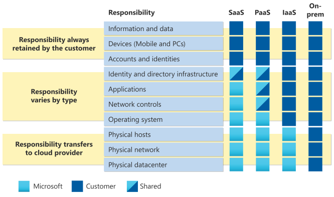

# Clound Concepts

## Cloud Computing

Cloud computing is the delivery of computing services over the internet. Computing services include common IT infrastructure such as virtual machines, storage, databases, and networking. Cloud services also expand the traditional IT offerings to include things like Internet of Things (IoT), machine learning (ML), and artificial intelligence (AI).

> Someone else's computer. Maintenance and upkeep is maintained elsewhere.

## Shared Responsibility Model

* Physical security, power, cooling, and network connectivity are the responsibility of the cloud provider.
* The consumer is responsible for the data and information stored in the cloud.
* The consumer is also responsible for access security, meaning you only give access to those who need it.

When using a cloud provider, you’ll always be responsible for:

* The information and data stored in the cloud
* Devices that are allowed to connect to your cloud (cell phones, computers, and so on)
* The accounts and identities of the people, services, and devices within your organization

The cloud provider is always responsible for:

* The physical datacenter
* The physical network
* The physical hosts

Your service model will determine responsibility for things like:

* Operating systems
* Network controls
* Applications
* Identity and infrastructure

## Cloud Models

| Public cloud | Private cloud | Hybrid cloud |
|--------------|---------------|--------------|
| No capital expenditures to scale up | Organizations have complete control over resources and security | Provides the most flexibility |
| Applications can be quickly provisioned and deprovisioned | Data is not collocated with other organizations’ data | Organizations determine where to run their applications |
| Organizations pay only for what they use | Hardware must be purchased for startup and maintenance | Organizations control security, compliance, or legal requirements |
| Organizations don’t have complete control over resources and security | Organizations are responsible for hardware maintenance and updates | |

### Multi-cloud

A fourth, and increasingly likely scenario is a multi-cloud scenario. In a multi-cloud scenario, you use multiple public cloud providers. Maybe you use different features from different cloud providers. Or maybe you started your cloud journey with one provider and are in the process of migrating to a different provider. Regardless, in a multi-cloud environment you deal with two (or more) public cloud providers and manage resources and security in both environments.

### Azure Arc

Azure Arc is a set of technologies that helps manage your cloud environment. Azure Arc can help manage your cloud environment, whether it's a public cloud solely on Azure, a private cloud in your datacenter, a hybrid configuration, or even a multi-cloud environment running on multiple cloud providers at once.

### Azure VMware Solution

What if you’re already established with VMware in a private cloud environment but want to migrate to a public or hybrid cloud? Azure VMware Solution lets you run your VMware workloads in Azure with seamless integration and scalability.

## Consumption Based Model

The consumption-based model has many benefits, including:

* No upfront costs.
* No need to purchase and manage costly infrastructure that users might not use to its fullest potential.
* The ability to pay for more resources when they're needed.
* The ability to stop paying for resources that are no longer needed.

## Benefits of Cloud Services

### High Availability

Azure is a highly available cloud environment with uptime guarantees depending on the service. These guarantees are part of the service-level agreements (SLAs).

* High availability focuses on ensuring maximum availability, regardless of disruptions or events that may occur.

### Scalability

Scalability refers to the ability to adjust resources to meet demand. If you suddenly experience peak traffic and your systems are overwhelmed, the ability to scale means you can add more resources to better handle the increased demand.

The other benefit of scalability is that you aren't overpaying for services. Because the cloud is a consumption-based model, you only pay for what you use. If demand drops off, you can reduce your resources and thereby reduce your costs.

Scaling generally comes in two varieties: vertical and horizontal. Vertical scaling is focused on increasing or decreasing the capabilities of resources. Horizontal scaling is adding or subtracting the number of resources.

#### Vertical scaling

With vertical scaling, if you were developing an app and you needed more processing power, you could vertically scale up to add more CPUs or RAM to the virtual machine. Conversely, if you realized you had over-specified the needs, you could vertically scale down by lowering the CPU or RAM specifications.

#### Horizontal scaling

With horizontal scaling, if you suddenly experienced a steep jump in demand, your deployed resources could be scaled out (either automatically or manually). For example, you could add additional virtual machines or containers, scaling out. In the same manner, if there was a significant drop in demand, deployed resources could be scaled in (either automatically or manually), scaling in.

### Reliability

Reliability is the ability of a system to recover from failures and continue to function.

### Predictability

Predictability in the cloud lets you move forward with confidence. Predictability can be focused on performance predictability or cost predictability.

### Performance

Performance predictability focuses on predicting the resources needed to deliver a positive experience for your customers. Autoscaling, load balancing, and high availability are just some of the cloud concepts that support performance predictability. If you suddenly need more resources, autoscaling can deploy additional resources to meet the demand, and then scale back when the demand drops. Or if the traffic is heavily focused on one area, load balancing will help redirect some of the overload to less stressed areas.

### Cost

Cost predictability is focused on predicting or forecasting the cost of the cloud spend. With the cloud, you can track your resource use in real time, monitor resources to ensure that you’re using them in the most efficient way, and apply data analytics to find patterns and trends that help better plan resource deployments. By operating in the cloud and using cloud analytics and information, you can predict future costs and adjust your resources as needed.

### Security and Governance

Things like set templates help ensure that all your deployed resources meet corporate standards and government regulatory requirements. Plus, you can update all your deployed resources to new standards as standards change. Cloud-based auditing helps flag any resource that’s out of compliance with your corporate standards and provides mitigation strategies. Depending on your operating model, software patches and updates may also automatically be applied, which helps with both governance and security.

On the security side, you can find a cloud solution that matches your security needs. If you want maximum control of security, infrastructure as a service provides you with physical resources but lets you manage the operating systems and installed software, including patches and maintenance. If you want patches and maintenance taken care of automatically, platform as a service or software as a service deployments may be the best cloud strategies for you.

And because the cloud is intended as an over-the-internet delivery of IT resources, cloud providers are typically well suited to handle things like distributed denial of service (DDoS) attacks, making your network more robust and secure.

By establishing a good governance footprint early, you can keep your cloud footprint updated, secure, and well managed.

### Manageability

#### Management of the cloud

Management of the cloud speaks to managing your cloud resources. In the cloud, you can:

* Automatically scale resource deployment based on need.
* Deploy resources based on a preconfigured template, removing the need for manual configuration.
* Monitor the health of resources and automatically replace failing resources.
* Receive automatic alerts based on configured metrics, so you’re aware of performance in real time.

#### Management in the cloud

Management in the cloud speaks to how you’re able to manage your cloud environment and resources. You can manage these:

* Through a web portal.
* Using a command line interface.
* Using APIs.
* Using PowerShell.

## Infrastructure as a Service

IaaS places the largest share of responsibility with you. The cloud provider is responsible for maintaining the physical infrastructure and its access to the internet. You’re responsible for installation and configuration, patching and updates, and security.

IaaS places the largest share of responsibility with you.

Some common scenarios where IaaS might make sense include:

* Lift-and-shift migration: You’re setting up cloud resources similar to your on-prem datacenter, and then simply moving the things running on-prem to running on the IaaS infrastructure.
* Testing and development: You have established configurations for development and test environments that you need to rapidly replicate. You can start up or shut down the different environments rapidly with an IaaS structure, while maintaining complete control.

## Platform as a Service

In a PaaS environment, the cloud provider maintains the physical infrastructure, physical security, and connection to the internet. They also maintain the operating systems, middleware, development tools, and business intelligence services that make up a cloud solution. In a PaaS scenario, you don't have to worry about the licensing or patching for operating systems and databases.

PaaS is well suited to provide a complete development environment without the headache of maintaining all the development infrastructure.

PaaS splits the responsibility between you and the cloud provider. The cloud provider is responsible for maintaining the physical infrastructure and its access to the internet, just like in IaaS. In the PaaS model, the cloud provider will also maintain the operating systems, databases, and development tools. Think of PaaS like using a domain joined machine: IT maintains the device with regular updates, patches, and refreshes.

Depending on the configuration, you or the cloud provider may be responsible for networking settings and connectivity within your cloud environment, network and application security, and the directory infrastructure.

Some common scenarios where PaaS might make sense include:

* Development framework: PaaS provides a framework that developers can build upon to develop or customize cloud-based applications. Similar to the way you create an Excel macro, PaaS lets developers create applications using built-in software components. Cloud features such as scalability, high-availability, and multi-tenant capability are included, reducing the amount of coding that developers must do.
* Analytics or business intelligence: Tools provided as a service with PaaS allow organizations to analyze and mine their data, finding insights and patterns and predicting outcomes to improve forecasting, product design decisions, investment returns, and other business decisions.

## Software as a Service

With SaaS, you’re essentially renting or using a fully developed application.

SaaS is the model that places the most responsibility with the cloud provider and the least responsibility with the user. In a SaaS environment you’re responsible for the data that you put into the system, the devices that you allow to connect to the system, and the users that have access. Nearly everything else falls to the cloud provider. The cloud provider is responsible for physical security of the datacenters, power, network connectivity, and application development and patching.

Some common scenarios for SaaS are:

* Email and messaging.
* Business productivity applications.
* Finance and expense tracking.

