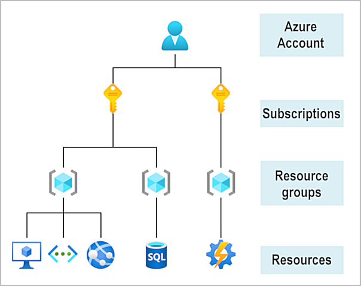
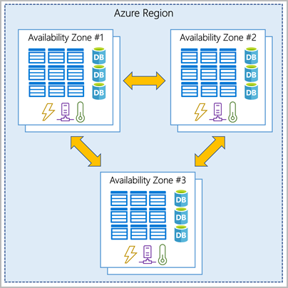
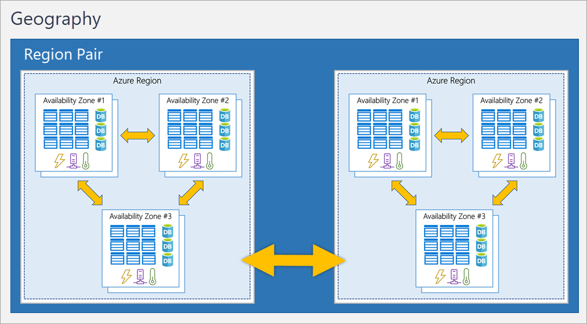

# Architecture and Services

## Azure Accounts

To create and use Azure services, you need an Azure subscription.

When you're working with your own applications and business needs, you need to create an Azure account, and a subscription will be created for you. After you've created an Azure account, you're free to create additional subscriptions.

## Sandbox

* PowerShell CLI
* Bash CLI `$ bash`: `pwsh`
* `az interactive`: `version`, `exit`
* Azure Portal (link in exercise)

## Azure Physical Infrastructure

The physical infrastructure for Azure starts with datacenters.

Datacenters are grouped into Azure Regions or Azure Availability Zones that are designed to help you achieve resiliency and reliability for your business-critical workloads.

### Regions

A region is a geographical area on the planet that contains at least one, but potentially multiple datacenters that are nearby and networked together with a low-latency network. Azure intelligently assigns and controls the resources within each region to ensure workloads are appropriately balanced.

### Availability Zones

Availability zones are physically separate datacenters within an Azure region. Each availability zone is made up of one or more datacenters equipped with independent power, cooling, and networking. An availability zone is set up to be an isolation boundary. If one zone goes down, the other continues working. Availability zones are connected through high-speed, private fiber-optic networks.

Azure services that support availability zones fall into three categories:

* Zonal services: You pin the resource to a specific zone (for example, VMs, managed disks, IP addresses).
* Zone-redundant services: The platform replicates automatically across zones (for example, zone-redundant storage, SQL Database).
* Non-regional services: Services are always available from Azure geographies and are resilient to zone-wide outages as well as region-wide outages.

### Region Pairs

Most Azure regions are paired with another region within the same geography (such as US, Europe, or Asia) at least 300 miles away. This approach allows for the replication of resources across a geography that helps reduce the likelihood of interruptions because of events such as natural disasters, civil unrest, power outages, or physical network outages that affect an entire region.

Additional advantages of region pairs:

* If an extensive Azure outage occurs, one region out of every pair is prioritized to make sure at least one is restored as quickly as possible for applications hosted in that region pair.
* Planned Azure updates are rolled out to paired regions one region at a time to minimize downtime and risk of application outage.
* Data continues to reside within the same geography as its pair (except for Brazil South) for tax- and law-enforcement jurisdiction purposes.

### Sovereign Regions

In addition to regular regions, Azure also has sovereign regions. Sovereign regions are instances of Azure that are isolated from the main instance of Azure. You may need to use a sovereign region for compliance or legal purposes.

Azure sovereign regions include:

* US DoD Central, US Gov Virginia, US Gov Iowa and more: These regions are physical and logical network-isolated instances of Azure for U.S. government agencies and partners. These datacenters are operated by screened U.S. personnel and include additional compliance certifications.
* China East, China North, and more: These regions are available through a unique partnership between Microsoft and 21Vianet, whereby Microsoft doesn't directly maintain the datacenters.

## Azure Management Infrastructure

### Azure Resources and Resource Groups

Resource groups are simply groupings of resources. When you create a resource, you’re required to place it into a resource group. While a resource group can contain many resources, a single resource can only be in one resource group at a time. Some resources may be moved between resource groups, but when you move a resource to a new group, it will no longer be associated with the former group. Additionally, resource groups can't be nested, meaning you can’t put resource group B inside of resource group A.

Resource groups provide a convenient way to group resources together. When you apply an action to a resource group, that action will apply to all the resources within the resource group. If you delete a resource group, all the resources will be deleted. If you grant or deny access to a resource group, you’ve granted or denied access to all the resources within the resource group.

When you’re provisioning resources, it’s good to think about the resource group structure that best suits your needs.

There aren’t hard rules about how you use resource groups, so consider how to set up your resource groups to maximize their usefulness for you.

### Azure Subscriptions

In Azure, subscriptions are a unit of management, billing, and scale. Similar to how resource groups are a way to logically organize resources, subscriptions allow you to logically organize your resource groups and facilitate billing.

Using Azure requires an Azure subscription. A subscription provides you with authenticated and authorized access to Azure products and services. It also allows you to provision resources. An Azure subscription links to an Azure account, which is an identity in Microsoft Entra ID or in a directory that Microsoft Entra ID trusts.

An account can have multiple subscriptions, but it’s only required to have one. In a multi-subscription account, you can use the subscriptions to configure different billing models and apply different access-management policies. You can use Azure subscriptions to define boundaries around Azure products, services, and resources. There are two types of subscription boundaries that you can use:

* Billing boundary: This subscription type determines how an Azure account is billed for using Azure. You can create multiple subscriptions for different types of billing requirements. Azure generates separate billing reports and invoices for each subscription so that you can organize and manage costs.
* Access control boundary: Azure applies access-management policies at the subscription level, and you can create separate subscriptions to reflect different organizational structures. An example is that within a business, you have different departments to which you apply distinct Azure subscription policies. This billing model allows you to manage and control access to the resources that users provision with specific subscriptions.

### Create additional Azure Subscriptions

Similar to using resource groups to separate resources by function or access, you might want to create additional subscriptions for resource or billing management purposes. For example, you might choose to create additional subscriptions to separate:

* Environments: You can choose to create subscriptions to set up separate environments for development and testing, security, or to isolate data for compliance reasons. This design is particularly useful because resource access control occurs at the subscription level.
* Organizational structures: You can create subscriptions to reflect different organizational structures. For example, you could limit one team to lower-cost resources, while allowing the IT department a full range. This design allows you to manage and control access to the resources that users provision within each subscription.
* Billing: You can create additional subscriptions for billing purposes. Because costs are first aggregated at the subscription level, you might want to create subscriptions to manage and track costs based on your needs. For instance, you might want to create one subscription for your production workloads and another subscription for your development and testing workloads.

Azure Management Groups

The final piece is the management group. Resources are gathered into resource groups, and resource groups are gathered into subscriptions. If you’re just starting in Azure that might seem like enough hierarchy to keep things organized. But imagine if you’re dealing with multiple applications, multiple development teams, in multiple geographies.

If you have many subscriptions, you might need a way to efficiently manage access, policies, and compliance for those subscriptions. Azure management groups provide a level of scope above subscriptions. You organize subscriptions into containers called management groups and apply governance conditions to the management groups. All subscriptions within a management group automatically inherit the conditions applied to the management group, the same way that resource groups inherit settings from subscriptions and resources inherit from resource groups. Management groups give you enterprise-grade management at a large scale, no matter what type of subscriptions you might have. Management groups can be nested.

## Management Group, Subscriptions, and Resource Group Hierarchy

You can build a flexible structure of management groups and subscriptions to organize your resources into a hierarchy for unified policy and access management.

Some examples of how you could use management groups might be:

* Create a hierarchy that applies a policy. You could limit VM locations to the US West Region in a group called Production. This policy will inherit onto all the subscriptions that are descendants of that management group and will apply to all VMs under those subscriptions. This security policy can't be altered by the resource or subscription owner, which allows for improved governance.
* Provide user access to multiple subscriptions. By moving multiple subscriptions under a management group, you can create one Azure role-based access control (Azure RBAC) assignment on the management group. Assigning Azure RBAC at the management group level means that all sub-management groups, subscriptions, resource groups, and resources underneath that management group would also inherit those permissions. One assignment on the management group can enable users to have access to everything they need instead of scripting Azure RBAC over different subscriptions.

Important facts about management groups:

* 10,000 management groups can be supported in a single directory.
* A management group tree can support up to six levels of depth. This limit doesn't include the root level or the subscription level.
* Each management group and subscription can support only one parent.

## Azure Compute and Networking Services

