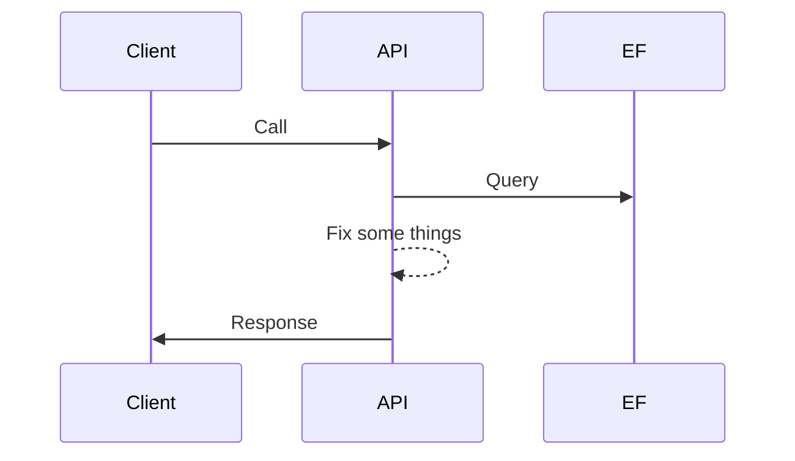

# Visual Studio - Live Share

## Scenarios

* Whiteboarding (Sketching in code)
* Code Review(s): Standards / Code being reviewed
* Show & Tell
* Pair Programming

## Pair Programming

Perspective by Role (can switch) ...

* Driver: Controls the keyboard and mouse, close to the code.
* Navigator: Strategic direction, at a higher level.

## Live Share

### Connecting

#### Live Share Window

* Participants
* Shared Terminals
* Shared Servers
* Comments
* Session Chat

#### Joining

* **Continue in Web** to use [https://vscode.dev](https://vscode.dev)
* **Open in Visual Studio Code**

### Co-Editing

* **Focus** Request in the Live Share Window.

### Whiteboarding

* Live Share Whiteboard
* [Mermaid](https://mermaid.js.org) (have to have the extension installed), native support in GitHub.

### Audio Calls

* Live Share Audio: ***DEPRECATED***.

## Shared Server(s)

* Share server (tcp port or url) ... (sometimes removes the `https://`).

## Shared Terminal(s)

* Share terminal ... (read only or read/write).

## Security Concerns

### Transport Security

* Encrypted E2E with SSH encryption, keys generated per session.
* Fallback to cloud-relay, plus TLS.

### Securing Content

* `.vsls.json`: Hiding files from collaborators; can still be viewed if opened by host.
* `.vsls.json`: Exclusing files for hiding and not showing when opened by host.

### Leveraging `.gitignore`

* `.gitignore` can be used to hide/exclude files from sharing.

### Limiting Debugger Access

* Debugger Control is off by default.

### Limiting Server and Terminal Access

* Share the minimum.
* Favor read-only terminals.
* Do not leave read/write terminals unattended.

## Scenarios

* Pair Programming
* Code Reviews
* Show & Tell
* Instructor / Class
* Office Hours
* Technical Support
* Interviews & Evaluation
* Code Jams / Contests
