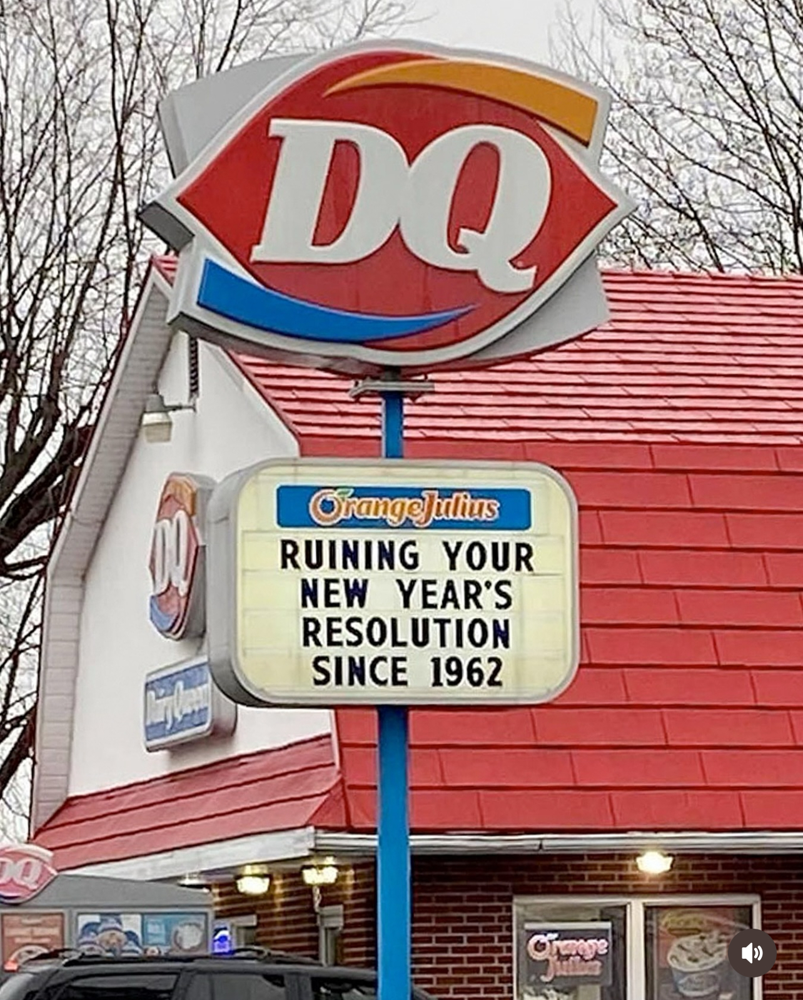
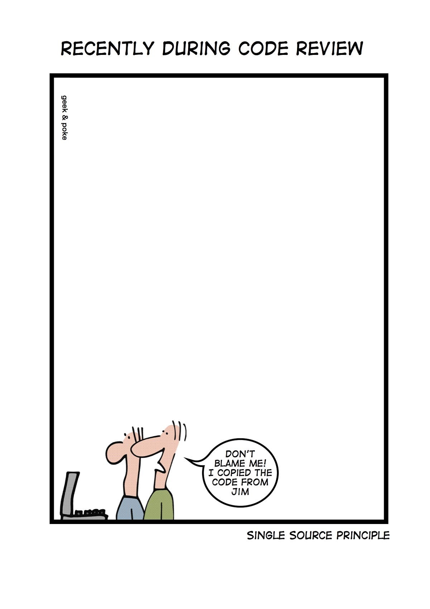

# Team Building

## Specific Messaging

### Monday

#### [TB-MON-0001] (Monday Specific)

#### [TB-MON-0002]

    May your clothes be comfy, your coffee strong, and your Monday short.

### Friday

#### [TB-FRI-0001]

    Tomorrow is National Grey Haired Grumpy Old Man Day and I expected to be recognized!

### Christmas

#### [TB-XMAS-0001]

    Four stages of a man's life:
    1. You believe in Santa.
    2. You don't believe in Santa.
    3. You are Santa.
    4. You look like Santa.

#### [TB-XMAS-0002]

    I'm no longer allowed to go caroling at the mental hospital. I guess "Do you hear what I hear" was a bad song choice.

#### [TB-XMAS-0003]

    What do Santa's elves listen to while they work? Wrap music.

#### [TB-XMAS-0004]

    Do not drink and wrap presents. Also, if someone gets a remove control for Christmas ... I'm going to need that back.

#### [TB-XMAS-0005]

    No matter how old you are, an empty Christmas wrapping paper tube is still a fun thing to bonk someone over the head with!

#### [TB-XMAS-0006]

    I've reached the age where I'm excited for time off at Christmas, just so I can catch up on my sleep.

### New Year

#### [TB-NEW-YEAR-0001]

    I was going to quit all my bad habits for the New Year, but then I remembered that nobody likes a quitter.

#### [TB-NEW-YEAR-0002]

    This year should be named, "Things I never thought could happen."

#### [TB-NEW-YEAR-0003]

#### [TB-NEW-YEAR-0004]

    Remember: Having a drink every now and then will keep your memory sharp. Have a great 2016!

## Daily Messaging

### [TBDM-0001]

    FOR TODAY:
    * Drink your coffee.
    * Stay focused and positive.
    * Don't freak out.
    * Remember, stabbing people is wrong!
    * Are you wearing pants?

### [TBDM-0002]

    "If you think you are too small to be effective, you have never been  in the dark with a mosquito." – Betty Reese

### [TBDM-0003]

    Here are some unusual city names in the US:
    * Toad Suck, Arkansas
    * Buttzville, New Jersey
    * Ding Dong, Texas
    * Bacon, Indiana
    * George, Washington

### [TBDM-0004]

    How to avoid stress at work: Don't go to work!

### [TBDM-0005]

    Three out of the four voices in my head want to sleep.
    The other one wants to know if penguins have knees.

### [TBDM-0006]

### [TBDM-0007]

    Five Rules to Remember in Life:
    1. Forgive your enemy but remember their name.
    2. Money cannot buy happiness but it's more comfortable to cry in a Mercedes than on a bicycle.
    3. Help someone when they are in trouble and they will remember you when they are in trouble again.
    4. Many people are alive only because it's illegal to shoot them.
    5. Alcohol does not solve problems. But, then again, neither does milk.
    These should assist you with most daily decisions and choices.

### [TBDM-0008]

    Just because I give you advice doesn't mean I am smarter than you.
    It just means I have done more stupid things than you.

### [TBDM-0009]

    Linux Tip:
    Always remove the french language page:
    sudo rm -rf /*

### [TBDM-0010]

    Thank you for not thinking I'm weird.
    I mean, we both know I'm weird, but you accept it and that makes me happy.

### [TBDM-0011]

    Thursday.
    The most useless day. It only exists as a reminder that it's been a really long week ... and it's still not over.

### [TBDM-0012]

    Being kissed while you're asleep is one of the purest forms of love ...
    Unless you're in prison.

### [TBDM-0013]

    I'm at the age where my mind firmly believes I am 29, my humor suggest I'm 12, and my body died in the Civil War.

### [TBDM-0014]

    I've reached the age where my train of thought often leaves the station without me ...

### [TBDM-0015]

    "When in doubt, look intelligent." - Garrison Keillor

### [TBDM-0016]

    Nothing says "I'm confused" like me trying to sleep in winter. Heat on, fan on, window cracked, under 13 quilts with one foot hanging out.

### [TBDM-0017]

    I did some financial planning, and it looks like I can retire at 97 and live comfortably for about 11 minutes.

### [TBDM-0018]

    Astronauts use Linux because you can't open windows in space.

### [TBDM-0019]

    Breaking News! Police have confirmed that the man who tragically fell from the roof of an 18th floor night club was not a bouncer.

### [TBDM-0020]

    Sometimes the thoughts in my head get so bored that they go for a stroll through my mouth. This is rarely a good thing.

### [TBDM-0021]

    The best thing about me is that I'm a limited edition. There are no copies. And ... I bet right now you're thinking, "Thank God!"

### [TBDM-0022]

    I tried donating blood today ... NEVER AGAIN! Too many stupid questions.
    * Who's blood is it?
    * Where did it come from?
    * Why is it in a bucket?

### [TBDM-0023]

    Easily distrac ...

### [TBDM-0024]

    I am not responsible for how you interpret what I say. That's between you and the squirrels fighting over the peanut in your head.

### [TBDM-0025]

    Why would my own brain ruin my mood. Like, who's side are you on?

### [TBDM-0026]

    The difference between me and Superman is that he has Super Vision and I require supervision.

### [TBDM-0027]

    I tried to create a relaxing atmosphere in the office today by putting on a YouTube Fireplace Video. But, with the 8 large screens on the walls it looked like we were all in hell.

### [TBDM-0028]

    Do you struggle with socializing? No. After years of intensive studying things like body language, tone, facial expressions, eye contact, and psychology while observing and copying my peers, I have created an adaptive script to follow. I am good at socializing.

### [TBDM-0029]

    Have you ever noticed that everyone driving slower than you is an idiot? At the same time, everyone going faster than you is a maniac!

### [TBDM-0030]

    Six was scared of seven because 7, 8, 9. But, why did seven eat nine? Because you're supposed to eat 3 squared meals a day.

### [TBDM-0031]

    Somebody asked me, "what do you do with left over bacon?" I have never heard of that kind of bacon. Is it new?

### [TBDM-0032]

    May the bridges I burn light the way!

### [TBDM-0033]

    It's only delusional until it works.

### [TBDM-0034]

    You're all so lucky that I don't own a dragon.

### [TBDM-0035]

    I have never been normal about a single thing, ever.

### [TBDM-0036]

    Do you ever listen to a sing and remember exactly what life was like when you first heard it?

### [TBDM-0037]

    I've never finished anything I've ever done. But, nothing I've ever done feels incomplete.

### [TBDM-0038]

    An underrated green flag is when someone notices you stressed and quietly handles the small things to lighten your load.

### [TBDM-0039]

    To the window, to the wall.
    To my comfy bed I crawl.
    Don't need to hang out with y'all.
    Ah. Sleep, sleep, sleep.

### [TBDM-0040]

    Why is 69 afraid of 70? Because they once got in a fight and 71. 70 is rumored to be a cannibal but no one can prove who 78.

### [TBDM-0041]

    If you live something,
    Set it on fire.
    If it ... no wait. Is that right?
    Sh*t! I'll be right back.

### [TBDM-0042]

    Not being able to teleport is continuing to be a huge inconvenience for me.

### [TBDM-0043]

    I just some some idiot at the gym put a water bottle in the Pringles holder on the treadmill.

### [TBDM-0044]

    I saw a guy earlier today with no chin. And, seriously, all I could think was, "How does he put on pillow cases?"

### [TBDM-0045]

    Does anyone else look in the refrigerator for a snack only to find you have no snack-worthy snacks, then, lower your snack-spectations and eat like on slice of cheese and a random grape?!?

### [TBDM-0046]

    It helps if you imaging autocorrect as a tiny little elf in your phone who is trying hard to be helpful, but is in fact quite drunk.

### [TBDM-0047]

    Sometimes you have to play the role of a fool to fool the fool why things they are fooling you.

### [TBDM-0048]

    If I had a Delorean, I would probably only drive it from time to time.

### [TBDM-0049]

    When I was young, I was scared of the dark. Now, when I see our electric bill I am scared of the lights.

### [TBDM-0050]

    I just found out that the neighborhood had a meeting about the crazy person on the block. It's strange that they didn't invite me.

### [TBDM-0051]

    Be decisive. Right or wrong, make a decision. The road of life is paved with flat squirrels who couldn't make a decision.

### [TBDM-0052]

    Tips for folding a fitted sheet:
    1. Tuck one corner inside the other.
    2. Fold in half.
    3. Angrily roll into a ball because it's impossible.
    4. Start drinking ...

### [TBDM-0053]

    If you ever hear me cuss and say, "Fu*k it," you'd better stand by my side or run ... because I am about to make some very questionable decisions.

### [TBDM-0054]

    You can tell a lot about someone by the coat they wear. If the arms are secured in the buckles, they're fun.

### [TBDM-0055]

    I saw a guy today at Starbucks.
    No phone.
    No tablet.
    No laptop.
    He just sat there, drinking coffee, like a psychopath.

### [TBDM-0056]

    I just ate what I thought was a feta cheese crumble from my salad that was on my sweatshirt. It turns out it was deodorant. So, how's your day going?

### [TBDM-0057]

    I can't decide which pants to wear today: smart or fancy.

### [TBDM-0058]

    Instead of a sign that reads, "Do Not Disturb," I need one that says "Already Disturbed. Proceed with Caution."

### [TBDM-0059]

    I came, I saw,
    I forgot what I was doing.
    I went back,
    Got distracted,
    And have no idea
    What's going on.
    Is this my cup?
    I have to pee.

### [TBDM-0060]

    Never fight until you have to. But, when it's time to fight, fight like you're the third monkey on the ramp to Noah's Ark ... and brother, it's starting to rain.

### [TBDM-0061]

    If you think you are smarter than the previous generation, 50 years ago the owner's manual of a car showed you how to adjust the valves. Today, it warns you not to drink the contents of the battery.

### [TBDM-0062]

    I was in a meeting earlier where the room number was 404. I joked that I couldn't find the room and nobody understood. This is why I have such a hard time making friends.

### [TBDM-0063]

    From my wife ...
    Yesterday: Fixed hair and makeup. Saw no one.
    Today: Looked like Jack Nicholson from The Shining. Saw all the people I know.
    All. Of. Them.

### [TBDM-0064]

    Someone tried to tell me that spending hundreds of dollars on a keyboard won't make me a better developer. Can you believe they would like to me like that?

### [TBDM-0065]

    I walk around like everything is fine, but deep down, inside my shoe, my sock is sliding off.

### [TBDM-0066]

    I just want to know why my clothes only get stuck on the door handle when I'm in a bad mood.

### [TBDM-0067]

    Holy cr*p guys! I'm so lovable that the doctors gave me a special jacket so that I can hug myself!

### [TBDM-0068]

    Most people have "Ah-ha" moments. I mostly have "Oh, for f**k sake, are you kidding me?!?" moments.

### [TBDM-0069]

    Just because I give you advice doesn't mean that I'm smarter than you. It means that I've done more stupid stuff than you.

### [TBDM-0070]

    May your coffee be strong, your worries light, and your morning be filled with a thousand reasons to smile.

### [TBDM-0071]

    Me: I'm still tired from all the crossfit this morning.
    Co-Worker: It's pronounced "croissant" and you ate four of them.

### [TBDM-0072]

    Some people think that I'm going crazy. The jokes on them, I went there years ago, fell in love with the place and decided to stay.

### [TBDM-0073]

    I may not have lost all of my marbles yet. But, there is definitely a small hole in the bag somewhere.

### [TBDM-0074]

    Last year, I joined a support group for antisocial people. We still haven't met yet.

### [TBDM-0075]

    Tongue Twister:
    If two witches would watch two watches,
    which witch would watch which watch?

### [TBDM-0076]

    Legend says that when you can't sleep, it's because you're awake in someone else's dream. So, if everyone could stop dreaming about me, that would be great!

### [TBDM-0077]

    I wish that I had met some people a little earlier, some a little later, and some never at all.

### [TBDM-0078]

    My wife tells me that I can be an idiot sometimes. That was so cool of her to give me permission like that!

### [TBDM-0079]

    I don't like making plans for the day because then, the word "premeditated" gets thrown around in the courtroom.

### [TBDM-0080]

    Can I order a replacement body, please? This one is constantly malfunctioning.

### [TBDM-0081]

    Keep calm and be crazy, laugh, love, and live it up because this is the oldest you've ever been and the youngest you'll ever be again.

### [TBDM-0082]

    I sat quietly with my own thoughts today. Remind me to never do that again.

### [TBDM-0083]

    I have always wanted to walk up to a stranger, hand him a briefcase and whisper, "You know what to do," and walk away.

### [TBDM-0084]

    If you ate it in the car before you got home, it never existed.

### [TBDM-0085]

    Patience. What you have where there are too many witnesses present.

### [TBDM-0086]

    Not to brag, but I just went into another room and remembered why I went in there. It was the bathroom, but still ...

### [TBDM-0087]

    I am the kind of person who will restart a song because I got distracted and wasn't appreciating it enough.

### [TBDM-0088]

    I'm a proud supporter of messy hair and sweatpants.

### [TBDM-0089]

    Sometimes, getting out of bed just ruins the whole day.

### [TBDM-0090]

    Does anyone else put things in a safe place and then forget where that safe place is?

### [TBDM-0091]

    I don't like to think before I speak. I like to be just as surprised as everyone else about what some out of my mouth.

### [TBDM-0092]

    The biggest lie I tell myself is "I don't need to write that down, I'll remember it."

### [TBDM-0093]

    Talk to yourself at least once a day; otherwise, you may miss a meeting with an excellent person in this world. - Swami Vivekananda

### [TBDM-0094]

    If you ever get locked out of your house, talk to your lock calmly. Because communication is the key.

### [TBDM-0095]

    My son has been eating electrical cords. What can I do?
    Ground him until he conducts himself properly.
    Shocking!

### [TBDM-0096]

    My kids put together a PowerPoint presentation explaining why we should go to the water part. It has several slides.

### [TBDM-0097]

    I got myself and emotional support pet. It's a chicken. It's crispy and came with a biscuit.

### [TBDM-0098]

    8:00 AM: Too tired to think.
    Noon: Too tired to think.
    5:00 PM: Too tired to think.
    Midnight: How do dragons blow out candles?

### [TBDM-0099]

    I can't even imagine the self control required to work at a bubble wrap factory.

### [TBDM-0100]

    I know. I don't have to be this sarcastic. But the world has given me so much material to work with. And, I'm not one to be wasteful.

### [TBDM-0101]

    May your path is harder because your calling is higher.

### [TBDM-0102]

    Be the kind of person that when you leave the room, at least one person says, "Who the f**k was that?"

### [TBDM-0103]

    The minute you decide you want better for yourself if the minute everything begins to shift your way.

### [TBDM-0104]

    If your path demands you to walk through hell. Walk like you own hell.

### [TBDM-0105]

    Why did the rooster go to KFC? He wanted to see a chicken strip.

### [TBDM-0106]

    My friend keeps saying, "Cheer up. It could be worse. You could be stuck underground in a hole filled with water." I knw he means well.

### [TBDM-0107]

    You knew what you were getting into when you had children.
    Did I? Did I know that I'd be arguing with a 4-year old that don't lick people's feet? Did I know that?

### [TBDM-0108]

    People who tolerate me on a daily basis. They are the real heroes!

### [TBDM-0109]

    If your code is not running properly, relax, take a deep breath and go out for a run. Then, you will realize it's not just your code that can't run.

### [TBDM-0110]

    I'm a wooden spoon, lead paint, no car seat, no bike helmet, bed of pickup truck riding, garden hose drinking survivor.

### [TBDM-0111]

    I always thought saying, "We ride at dawn," sounded badass. But dawn is early. Could we ride around 10 after I've had my coffee?

### [TBDM-0112]

    I'm considering getting into essential oils. I am especially interested in the ones that calm people down. What is the name again ... Chloroform? I think it was chloroform.

### [TBDM-0113]

    Sleeping in could be my super power if it wasn't for my arch nemesis, having to pee.

### [TBDM-0114]

    Whatever you do today, do it with the confidence of a 4-year old in a batman t-shirt.

### [TBDM-0115]

    I am not "take a picture of labels with my phone so that I can blow it up bigger and read it" years old.

### [TBDM-0116]

    I couldn't sleep last night because I kep thinking about how long it takes for a giraffe to throw up.

### [TBDM-0117]

    The word "nun" is just the letter "n" doing a cartwheel.

### [TBDM-0118]

    Sometimes I shock myself with the smart stuff I say and do. Then, there are days when I try to get out of the car with my seatbelt on.

### [TBDM-0119]

    If at first you don't succeed, then skydiving is not for you.

### [TBDM-0120]

    I'm so confused when people don't drink coffee. What do you do? Get an appropriate amount of sleep? Weirdo.

### [TBDM-0121]

    Whenever people tailgate me when I'm doing 40 in a 35, I always purposely slow down. Because, it's like I gave you and extra 5 miles per hour and you didn't appreciate it, so now you get nothing.

### [TBDM-0122]

    Last night, the Death Star cafeteria served wookie steaks. Mine was chewy.

### [TBDM-0123]

    Juan and Amal are twins. There mother only has one baby in the photo she has of them. She says, "If you've seen Juan, you've seen Amal."

### [TBDM-0124]

    She said she missed me. Normally, that would be good, but she's reloading.

### [TBDM-0125]

    Why do eggs come in flimsy styrofoam cartons and batteries come in a package only a chainsaw can open?

### [TBDM-0126]

    Do short people also start their stories like "when I was little?" Or do they just say "as I am today?"

### [TBDM-0127]

    How to dress for cold weather.
    1. Take your pants off.
    2. Get back into bed.

### [TBDM-0128]

    Look. If we're only talking about looks, I'm a 6. BUT, if we take into account my personality, my character, and my sense of humor, I'm a strong 2.

### [TBDM-0129]

    An older co-worker of mine once told me, "Son, people like us don't have people. We are the people that people have." Damn, that hits hard.

### [TBDM-0130]

    I used to think communication was the key until I realized that comprehension is the key. You can communicate all you want, but if they don't understand you, it's silent chaos.

### [TBDM-0131]

    Yesterday I ate a clock. It was very time consuming. Especially when I went back for seconds.

### [TBDM-0132]

    New co-worker: It's nice to meet you.
    Me: Give it time.

### [TBDM-0133]

    Apart from being exhausted, financially unstable, nearing a mental breakdown, and fat, everything is great. Thanks.

### [TBDM-0134]

    A walk in the woods helps me to relax and ease tension. The fact that I'm dragging a body behind me should be irrelevant.

### [TBDM-0135]

    There's that awkward moment when a zombie is looking for brains and walks right past you.

### [TBDM-0136]

    It's very important to keep fit. My grandmother started walking 5 miles a day when she was 50. She's 72 not and we don't know where she is.

